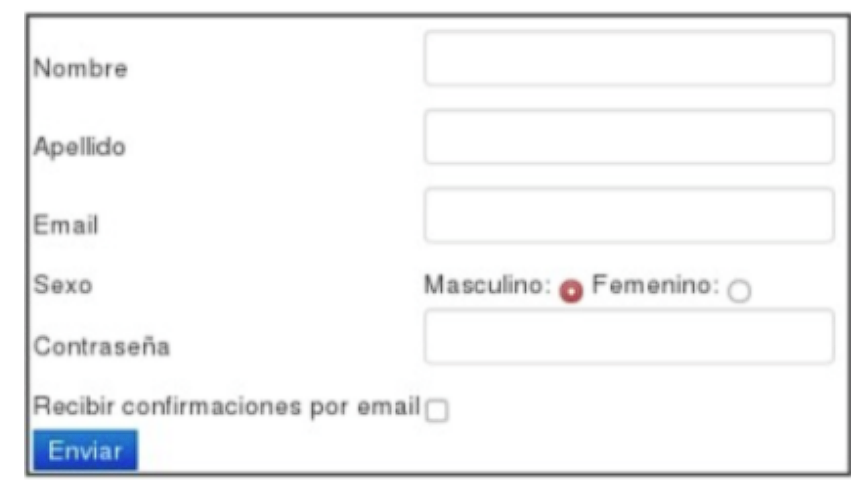
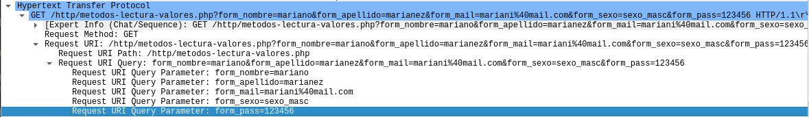
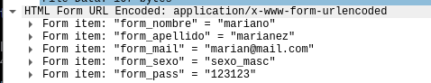

# Practica 2 - Capa de Aplicacion HTTP

1. ## ¿Cuál es la función de la capa de aplicación?

    La función de la capa de Aplicación es proveer Servicios de comunicación a los usuarios y a las aplicaciones. Ofrece la interfaz para el usuario. Las aplicaciones que usan la red pertenecen a esta capa al igual que los protocolos que implementan. Hay aplicaciones que no son de red que deben trabajar con aplicaciones/servicios para lograr acceso a la red.

	Define el formato de los mensajes. Existen protocolos que trabajan de forma binaria como ASN y otros que trabajan de forma textual ASCII como HTTP.

	Define la semántica de cada uno de los mensajes.

	Define cómo debe ser el intercambio de mensajes. Qué mensajes se deben intercambiar.

2. ## Si dos procesos deben comunicarse:
    - ### a. ¿Cómo podrían hacerlo si están en diferentes máquinas?

        Si están en diferentes máquinas pueden conectarse mediante la red, ya sea por Cable Ethernet, por Internet Inalámbrico o por alguna computadora actuando como Servidor común

    - ### b. Y si están en la misma máquina, ¿qué alternativas existen?

        Si están en la misma máquina puede usarse un pasaje de mensajes o utilizar la memoria para depositar los datos.

3. ## Explique brevemente cómo es el modelo Cliente/Servidor. Dé un ejemplo de un sistema Cliente/Servidor en la “vida cotidiana” y un ejemplo de un sistema informático que siga el modelo Cliente/Servidor. ¿Conoce algún otro modelo de comunicación?

    Es un modelo en el cual el cliente pone procesamiento de la interfaz y el servidor el resto del procesamiento. Este servidor corre servicios esperando de forma pasiva la conexión. El cliente se conecta al servidor y se comunican a través de este. El servidor necesita estar siempre encendido y con una IP estática. Mientras que el cliente puede conectarse intermitentemente, puede tener IP dinámica y nunca va a comunicarse con otro cliente.

	Un ejemplo en la vida cotidiana sería cualquier tipo de práctica comercial, existen dos figuras relevantes, cada una de las cuales desempeña su propio papel. Una de estas figuras, el Cliente, se dedica a una determinada actividad comercial, ofrece sus productos y desempeña una serie de funciones. Pero esta figura no puede dar servicio a todas sus funciones sin la existencia de otra, El Servidor, quien proporciona al Cliente las materias primas necesarias para el cumplimiento de sus funciones. Además, se ha de garantizar que este flujo de peticiones y de respuestas-de-peticiones se realiza en tiempo real, es decir, que las dos figuras mencionadas han de actuar simultáneamente, de forma que la actividad de uno no se vea perjudicada por la del otro. El Cliente puede realizar peticiones al Servidor (para que le proporcione el material necesario) sin interrumpir su actividad.

	Un ejemplo del mundo informático podría ser el correo electrónico, un servicio de impresión o la World Wide Web (WWW).

4. ## Describa la funcionalidad de la entidad genérica “Agente de usuario” o “User agent”.

    Es una interfaz entre el usuario y la aplicación de red. Por ejemplo: en la WEB, el agente de usuario es el navegador, el cual permite al usuario visualizar las páginas WEB e interactuar con los elementos de la misma. El navegador es un proceso que envía/recibe mensajes por medio de un socket y además brinda la interfaz al usuario.

	Un agente de usuario es una aplicación informática que funciona como cliente en un protocolo de red; el nombre se aplica generalmente para referirse a aquellas aplicaciones que acceden a la World Wide Web. Los agentes de usuario que se conectan a la Web pueden ser desde navegadores web hasta los web crawler de los buscadores, pasando por teléfonos móviles, lectores de pantalla y navegadores en Braille usados por personas con discapacidades.

	Cuando un usuario accede a una página web, la aplicación generalmente envía una cadena de texto que identifica al agente de usuario ante el servidor. Este texto forma parte de la petición a través de HTTP, llevando como prefijo User-Agent: y generalmente incluye información como el nombre de la aplicación, la versión, el sistema operativo, y el idioma. Los bots, como los web crawlers, a veces incluyen también una URL o una dirección de correo electrónico para que el administrador del sitio web pueda contactar con el operador del mismo.

	La identificación de agente de usuario es uno de los criterios de exclusión utilizado por el Estándar de exclusión de robots para impedir el acceso a ciertas secciones de un sitio web.

5. ## ¿Qué son y en qué se diferencian HTML y HTTP?

    **HTML** (HyperText Markup Language) es un lenguaje el cual marca el texto normal para que se transforme en Hipertexto. Básicamente los tags de HTML son usados para marcar texto normal que se convierte en hipertexto y varias páginas pueden ser conectadas con otras formando la web.

    Por otro lado, **HTTP** (HyperText Transfer Protocol) es un protocolo para transferir los hipertextos del servidor web hasta el navegador web. Para intercambiar páginas entre el servidor y el navegador, una sesión de HTTP es seteada usando métodos de protocolo.

6. ## HTTP tiene definido un formato de mensaje para los requerimientos y las respuestas.

    - ### a. ¿Qué información de la capa de aplicación nos indica si un mensaje es de requerimiento o de respuesta para HTTP? ¿Cómo está compuesta dicha información? ¿Para qué sirven las cabeceras?

        Si el mensaje lleva un metodo HTTP podemos decir que es un mensaje de requerimiento, mientras que si lleva un codigo de estado HTTP podemos decir que es un mensaje de respuesta.

        La información que nos indica si un mensaje es de requerimiento o de respuesta para HTTP se encuentra en la primera línea del mensaje, la cual se llama línea de inicio.

        En el caso de un mensaje de requerimiento, la línea de inicio está compuesta por el método HTTP, la URL del recurso solicitado y la versión del protocolo HTTP. En el caso de un mensaje de respuesta, la línea de inicio está compuesta por la versión del protocolo HTTP, el código de estado y una frase descriptiva del código de estado.

    - ### b. ¿Cuál es su formato? (Ayuda: https://developer.mozilla.org/es/docs/Web/HTTP/Headers)

        - #### Mensaje de requerimiento:
            ```
            GET /unadireccion/pagina.html HTTP/1.1
            Host: www.unaescuela.edu
            Connection: close
            User-agent: Mozilla/4.0
            Accept-language: fr
            ```

        - #### Mensaje de respuesta:
            ```
            HTTP/1.1 200 OK
            Connection: close
            Date: Sat, 07 Jul 2007 12:00:15 GMT
            Server: Apache/1.3.0 (Unix)
            Last-Modified: Sun, 6 May 2007 09:23:24 GMT
            Content-Length: 6821
            Content-Type: text/html
            ```

    - ### c. Suponga que desea enviar un requerimiento con la versión de HTTP 1.1 desde curl/7.74.0 a un sitio de ejemplo como www.misitio.com para obtener el recurso /index.html. En base a lo indicado, ¿qué información debería enviarse mediante encabezados? Indique cómo quedaría el requerimiento.

        ```
        GET /index.html HTTP/1.1
        Host: www.misitio.com
        User-agent: curl/7.74.0
        ```

7. ## Utilizando la VM, abra una terminal e investigue sobre el comando curl. Analice para qué sirven los siguientes parámetros (-I, -H, -X, -s).

    - El parámetro **–I** sirve para obtener los Headers de un documento en servidores HTTP, para archivos FTP o FILE obtiene solo el tamaño del archivo y la última fecha de modificación.

	- El parámetro **–H** se utiliza para añadir un Header extra a la petición del servidor. Se pueden especificar cualquier número de Headers adicionales.

	- El parámetro **–X** sirve para especificar un método para la petición cuando se comunica con el servidor HTTP. Este método se va a usar en vez del método que se tendría que utilizar (que por defecto es el GET).

	- El parámetro **–s** sirve para ponerlo en modo silencioso, lo que hace que no muestre un medidor de progreso o mensajes de error. Aun así, va a mostrar la información que fue pedida, a menos que se redireccione.

8. ## Ejecute el comando curl sin ningún parámetro adicional y acceda a *www.redes.unlp.edu.ar.* Luego responda:
    - ### a. ¿Cuántos requerimientos realizó y qué recibió? Pruebe redirigiendo la salida (>) del comando curl a un archivo con extensión html y abrirlo con un navegador.

        Realicé un único requerimiento y recibí el código en html del sitio. Cuando lo dirigí hacia un archivo html y lo ejecuté se abrió una página web de la materia.

    - ### b. ¿Cómo funcionan los atributos href de los tags link e img en html?

        El atributo href de los tags link e img en html se utiliza para especificar la URL del recurso al que se hace referencia. En el caso del tag link, se utiliza para enlazar un archivo CSS externo que contiene estilos para la página web. En el caso del tag img, se utiliza para especificar la URL de una imagen que se desea mostrar en la página web.

        Cuando un navegador web encuentra un tag link con un atributo href, realiza un requerimiento HTTP para obtener el archivo CSS y aplicarlo a la página web. De manera similar, cuando encuentra un tag img con un atributo href, realiza un requerimiento HTTP para obtener la imagen y mostrarla en la página web.

    - ### c. Para visualizar la página completa con imágenes como en un navegador, ¿alcanza con realizar un único requerimiento?

        No, no se puede con un solo requerimiento. Se necesitan tantos requerimientos como archivos o imágenes quieran mostrarse en la página. Una página hace más de un requerimiento mientras que el curl solo hace uno solo a la URL especificada

    - ### d. ¿Cuántos requerimientos serían necesarios para obtener una página que tiene dos CSS, dos Javascript y tres imágenes? Diferencie cómo funcionaría un navegador respecto al comando curl ejecutado previamente

        Para obtener una página que tiene dos CSS, dos Javascript y tres imágenes serían necesarios 8 requerimientos: uno para la página HTML, dos para los archivos CSS, dos para los archivos Javascript y tres para las imágenes.

        Un navegador web realiza múltiples requerimientos de forma automática para obtener todos los recursos necesarios para mostrar la página completa, mientras que el comando curl solo realiza un requerimiento a la URL especificada y no sigue los enlaces para obtener los recursos adicionales.

9. ## Ejecute a continuación los siguientes comandos:
    `curl -v -s www.redes.unlp.edu.ar > /dev/null`

    `curl -I -v -s www.redes.unlp.edu.ar`

    - ### a. ¿Qué diferencias nota entre cada uno?

        El primer comando pide toda la página mientras que el segundo solo pide los Headers, es decir, el primero lo llama con un GET y el segundo con un HEAD.

    - ### b. ¿Qué ocurre si en el primer comando se quita la redirección a /dev/null? ¿Por qué no es necesaria en el segundo comando?

        Si se quitase la redirección, aparte de mostrar lo que le manda al servidor y lo que el servidor responde, mostraría el código de la página ya que está pidiendo la página con un GET. En cambio, el segundo comando lo está pidiendo con un HEAD por lo que solo va a devolver los Headers.

    - ### c.  ¿Cuántas cabeceras viajaron en el requerimiento? ¿Y en la respuesta?

        En el requerimiento de la página viajaron 4 cabeceras mientras que en la respuesta se recibieron 8 cabeceras.

10. ## ¿Qué indica la cabecera Date?

    La cabecera Date indica la fecha y hora en que el mensaje fue enviado. En el caso de un mensaje de requerimiento, indica la fecha y hora en que el cliente envió el mensaje al servidor. En el caso de un mensaje de respuesta, indica la fecha y hora en que el servidor envió el mensaje al cliente. Esta información es útil para sincronizar los relojes entre el cliente y el servidor, así como para fines de registro y depuración.

11. ## En HTTP/1.0, ¿cómo sabe el cliente que ya recibió todo el objeto solicitado de manera completa? ¿Y en HTTP/1.1?

    En HTTP/1.0, el cliente sabe que ha recibido todo el objeto solicitado de manera completa cuando la conexión se cierra después de enviar la respuesta. Esto se debe a que en HTTP/1.0, cada solicitud y respuesta se maneja en una conexión separada, por lo que el cierre de la conexión indica que se ha completado la transferencia del objeto.

    En HTTP/1.1, el cliente puede saber que ha recibido todo el objeto solicitado de manera completa utilizando la cabecera Content-Length, que indica el tamaño del objeto en bytes. El cliente puede leer los datos hasta alcanzar el número de bytes especificado en esta cabecera para asegurarse de que ha recibido todo el objeto. Además, HTTP/1.1 también permite el uso de Transfer-Encoding: chunked, donde los datos se envían en fragmentos (chunks) y el final del objeto se indica con un chunk de tamaño cero.

12. ## Investigue los distintos tipos de códigos de retorno de un servidor web y su significado. Considere que los mismos se clasifican en categorías (2XX, 3XX, 4XX, 5XX).

    - **2XX**: Indica que la solicitud fue recibida, entendida y aceptada correctamente. Ejemplo: 200 OK, 201 Created.

    - **3XX**: Indica que se requiere una acción adicional para completar la solicitud, generalmente una redirección. Ejemplo: 301 Moved Permanently, 302 Found.

    - **4XX**: Indica un error del cliente, lo que significa que la solicitud no pudo ser procesada debido a un error en la sintaxis o en la solicitud. Ejemplo: 400 Bad Request, 404 Not Found.

    - **5XX**: Indica un error del servidor, lo que significa que el servidor falló al procesar una solicitud válida. Ejemplo: 500 Internal Server Error, 503 Service Unavailable.

13. ## Utilizando curl, realice un requerimiento con el método HEAD al sitio www.redes.unlp.edu.ar e indique:
    - ### a. ¿Qué información brinda la primera línea de la respuesta?
        La primera línea de la respuesta indica la versión del protocolo HTTP que se está utilizando, el código de estado de la respuesta y una frase descriptiva del código de estado. En este caso, la primera línea podría ser algo como: "HTTP/1.1 200 OK", lo que indica que se está utilizando HTTP/1.1, que la solicitud fue exitosa (código 200) y que el mensaje es "OK".
    - ### b. ¿Cuántos encabezados muestra la respuesta?
        Muestra 8 encabezados en la respuesta.

        - HTTP/1.1 200 OK
        - **Date**: Wed, 10 Jun 2026 13:20:59 GMT
        - **Server**: Apache/2.4.56 (Unix)
        - **Last-Modified**: Sun, 19 Mar 2023 19:04:46 GMT
        - **ETag**: "1322-5f7457bd64f80"
        - **Accept-Ranges**: bytes
        - **Content-Length**: 4898
        - **Content-Type**: text/html

    - ### c. ¿Qué servidor web está sirviendo la página?

        El servidor web que está sirviendo la página es Apache/2.4.56 (Unix).

    - ### d. ¿El acceso a la página solicitada fue exitoso o no?
        El acceso a la página solicitada fue exitoso, ya que el código de estado en la primera línea de la respuesta es 200 OK, lo que indica que la solicitud fue procesada correctamente por el servidor y se pudo acceder a la página sin problemas.

    - ### e. ¿Cuándo fue la última vez que se modificó la página?
        La última vez que se modificó la página fue el Sun, 19 Mar 2023 19:04:46 GMT, según lo indicado en el encabezado Last-Modified de la respuesta.

    - ### f. Solicite la página nuevamente con curl usando GET, pero esta vez indique que quiere obtenerla sólo si la misma fue modificada en una fecha posterior a la que efectivamente fue modificada. ¿Cómo lo hace? ¿Qué resultado obtuvo? ¿Puede explicar para qué sirve?
        Para solicitar la página nuevamente con curl usando GET y obtenerla solo si fue modificada en una fecha posterior a la que efectivamente fue modificada, se puede utilizar el encabezado If-Modified-Since. El comando sería algo como:

        `
        curl -v -s -H "If-Modified-Since: Sun, 19 Mar 2023 19:04:46 GMT" www.redes.unlp.edu.ar
        `

        En este caso, el resultado obtenido sería una respuesta con el código de estado 304 Not Modified, lo que indica que la página no ha sido modificada desde la fecha especificada en el encabezado If-Modified-Since. Esto significa que el cliente puede seguir utilizando la versión en caché de la página sin necesidad de descargarla nuevamente.

        Este mecanismo es útil para optimizar el uso del ancho de banda y mejorar el rendimiento, ya que permite a los clientes evitar descargar recursos innecesarios si no han cambiado desde la última vez que fueron solicitados.

14. ## Utilizando curl, acceda al sitio www.redes.unlp.edu.ar/restringido/index.php y siga las instrucciones y las pistas que vaya recibiendo hasta obtener la respuesta final. Será de utilidad para resolver este ejercicio poder analizar tanto el contenido de cada página como los encabezados.

    Para acceder al sitio www.redes.unlp.edu.ar/restringido/index.php, se puede utilizar el siguiente comando curl:

    ```bash
    curl www.redes.unlp.edu.ar/restringido/index.php
    <h1>Acceso restringido</h1>

    <p>Para acceder al contenido es necesario autenticarse. Para obtener los datos de acceso seguir las instrucciones detalladas en www.redes.unlp.edu.ar/obtener-usuario.php</p>
    ```
    ```bash
    curl www.redes.unlp.edu.ar/obtener-usuario.php

    <p>Para obtener el usuario y la contraseña haga un requerimiento a esta página seteando el encabezado 'Usuario-Redes' con el valor 'obtener'</p>
    ```

    ```bash
    curl -H "Usuario-Redes:obtener" www.redes.unlp.edu.ar/obtener-usuario.php
    <p>Bien hecho! Los datos para ingresar son:

    Usuario: redes

    Contraseña: RYC

    Ahora vuelva a acceder a la página inicial con los datos anteriores.

    PISTA: Investigue el uso del encabezado Authorization para el método Basic. El comando base64 puede ser de ayuda!</p>

    ```

    ```bash
    echo "redes:RYC" | base64
    cmVkZXM6UllDCg
    ```

    ```bash
    curl -H "Authorization: Basic cmVkZXM6UllD" www.redes.unlp.edu.ar/restringido/index.php
    <h1>Excelente!</h1>

    <p>Para terminar el ejercicio deberás agregar en la entrega los datos que se muestran en la siguiente página.</p>
    <p>ACLARACIÓN: la URL de la siguiente página está contenida en esta misma respuesta.</p>
    ```

    ```bash
    curl -i -H "Authorization: Basic cmVkZXM6UllD" www.redes.unlp.edu.ar/restringido/index.php
    HTTP/1.1 302 Found
    Date: Wed, 10 Jun 2026 13:51:52 GMT
    Server: Apache/2.4.56 (Unix)
    X-Powered-By: PHP/7.4.33
    Location: http://www.redes.unlp.edu.ar/restringido/the-end.php
    Content-Length: 230
    Content-Type: text/html; charset=UTF-8

    <h1>Excelente!</h1>

    <p>Para terminar el ejercicio deberás agregar en la entrega los datos que se muestran en la siguiente página.</p>
    <p>ACLARACIÓN: la URL de la siguiente página está contenida en esta misma respuesta.</p>
    ```

    ```bash
    curl -i -H "Authorization: Basic cmVkZXM6UllD" www.redes.unlp.edu.ar/restringido/the-end.php
    HTTP/1.1 200 OK
    Date: Wed, 10 Jun 2026 13:52:04 GMT
    Server: Apache/2.4.56 (Unix)
    X-Powered-By: PHP/7.4.33
    Content-Length: 159
    Content-Type: text/html; charset=UTF-8

    ¡Felicitaciones, llegaste al final del ejercicio!

    Fecha: 2026-06-10 13:52:04
    Verificación: 3055d394d645eb2b2a8b608553252029a172e70c300dbab80d040f9d87460d8c
    ```

15. ## Utilizando la VM, realice las siguientes pruebas:
    - ### a. Ejecute el comando ’curl www.redes.unlp.edu.ar/extras/prueba-http-1-0.txt’ y copie la salida completa (incluyendo los dos saltos de línea del final).

        ```
        GET /http/HTTP-1.1/ HTTP/1.0
        User-Agent: curl/7.38.0
        Host: www.redes.unlp.edu.ar
        Accept: */*
        ```

    - ### b. Desde la consola ejecute el comando telnet www.redes.unlp.edu.ar 80 y luego pegue el contenido que tiene almacenado en el portapapeles. ¿Qué ocurre luego de hacerlo?

        ```bash
        telnet www.redes.unlp.edu.ar 80

        Trying 172.28.0.50...
        Connected to www.redes.unlp.edu.ar.
        Escape character is '^]'.
        GET /http/HTTP-1.1/ HTTP/1.0
        User-Agent: curl/7.38.0
        Host: www.redes.unlp.edu.ar
        Accept: */*


        HTTP/1.1 200 OK
        Date: Wed, 10 Jun 2026 14:07:10 GMT
        Server: Apache/2.4.56 (Unix)
        Last-Modified: Sun, 19 Mar 2023 19:04:46 GMT
        ETag: "760-5f7457bd64f80"
        Accept-Ranges: bytes
        Content-Length: 1888
        Connection: close
        Content-Type: text/html

        <!DOCTYPE html>
        <html lang="en">
          <head>
            <meta charset="utf-8">
            <title>Protocolo HTTP: versiones</title>
            <meta name="viewport" content="width=device-width, initial-scale=1.0">
            <meta name="description" content="">
            <meta name="author" content="">

            <!-- Le styles -->
            <link href="../../bootstrap/css/bootstrap.css" rel="stylesheet">
            <link href="../../css/style.css" rel="stylesheet">
            <link href="../../bootstrap/css/bootstrap-responsive.css" rel="stylesheet">

            <!-- HTML5 shim, for IE6-8 support of HTML5 elements -->
            <!--[if lt IE 9]>
              <script src="./bootstrap/js/html5shiv.js"></script>
            <![endif]-->
          </head>

          <body>


            <div id="wrap">

            <div class="navbar navbar-inverse navbar-fixed-top">
              <div class="navbar-inner">
                <div class="container">
                  <a class="brand" href="../../index.html"><i class="icon-home icon-white"></i></a>
                  <a class="brand" href="https://catedras.info.unlp.edu.ar" target="_blank">Redes y Comunicaciones</a>
                  <a class="brand" href="http://www.info.unlp.edu.ar" target="_blank">Facultad de Inform&aacute;tica</a>
                  <a class="brand" href="http://www.unlp.edu.ar" target="_blank">UNLP</a>
                </div>
              </div>
            </div>

            <div class="container">
            <h1>Ejemplo del protocolo HTTP 1.1</h1>
            <p>
                Esta p&aacute;gina se visualiza utilizando HTTP 1.1. Utilizando el capturador de paquetes analice cuantos flujos utiliza el navegador para visualizar la p&aacute;gina con sus im&aacute;genes en contraposici&oacute;n con el protocolo HTTP/1.0.
            </p>
            </p>
            <h2>Imagen de ejemplo</h2>
            
            </div>


            </div>
            <div id="footer">
              <div class="container">
                <p class="muted credit">Redes y Comunicaciones</p>
              </div>
            </div>
          </body>
        </html>
        Connection closed by foreign host.
        ```

        Devuelve el código HTML de la página solicitada, lo que indica que el servidor ha procesado correctamente la solicitud y ha enviado la respuesta al cliente. Después de mostrar el contenido de la página, la conexión se cierra automáticamente debido a que se está utilizando HTTP/1.0, que no permite mantener la conexión abierta para múltiples solicitudes y respuestas.


    - ### c. Repita el proceso anterior, pero copiando la salida del recurso /extras/prueba-http-1-1.txt. Verifique que debería poder pegar varias veces el mismo contenido sin tener que ejecutar el comando telnet nuevamente

        Ahora la conexión se mantiene abierta, lo que permite pegar varias veces el mismo contenido sin tener que ejecutar el comando telnet nuevamente. Esto se debe a que el recurso solicitado utiliza HTTP/1.1, que permite mantener la conexión abierta para múltiples solicitudes y respuestas, a diferencia de HTTP/1.0, que cierra la conexión después de cada solicitud y respuesta.

16. ## En base a lo obtenido en el ejercicio anterior, responda:
    - ### a. ¿Qué está haciendo al ejecutar el comando telnet?
        Al ejecutar el comando telnet, se establece una conexión TCP con el servidor web en el puerto 80, que es el puerto estándar para HTTP. Esto permite enviar manualmente solicitudes HTTP al servidor y recibir las respuestas correspondientes. En este caso, se está utilizando telnet para enviar solicitudes HTTP de forma manual y observar las respuestas del servidor, lo que es útil para entender cómo funciona el protocolo HTTP y para realizar pruebas de diagnóstico.
    - ### b. ¿Qué método HTTP utilizó? ¿Qué recurso solicitó?
        En el ejercicio anterior, se utilizó el método HTTP GET para solicitar el recurso /http/HTTP-1.1/. El método GET se utiliza para solicitar la representación de un recurso específico, en este caso, una página web o un archivo ubicado en el servidor. El recurso solicitado es la URL /http/HTTP-1.1/, que corresponde a una página que muestra un ejemplo del protocolo HTTP 1.1.
    - ### c. ¿Qué diferencias notó entre los dos casos? ¿Puede explicar por qué?

        La principal diferencia entre los dos casos es que en el primer caso, utilizando HTTP/1.0, la conexión se cierra automáticamente después de cada solicitud y respuesta, lo que significa que se necesita establecer una nueva conexión para cada solicitud adicional. En cambio, en el segundo caso, utilizando HTTP/1.1, la conexión se mantiene abierta para múltiples solicitudes y respuestas, lo que permite enviar varias solicitudes sin tener que establecer una nueva conexión cada vez.

        Esta diferencia se debe a las mejoras introducidas en HTTP/1.1, que incluyen la capacidad de mantener conexiones persistentes (keep-alive) para mejorar el rendimiento y reducir la latencia al evitar la necesidad de establecer nuevas conexiones para cada solicitud. Esto es especialmente beneficioso cuando se solicitan múltiples recursos relacionados, como imágenes, hojas de estilo y scripts en una página web, ya que permite obtener todos los recursos necesarios sin tener que abrir y cerrar conexiones repetidamente.
    - ### d. ¿Cuál de los dos casos le parece más eficiente? Piense en el ejercicio donde analizó la cantidad de requerimientos necesarios para obtener una página con estilos, javascripts e imágenes. El caso elegido, ¿puede traer asociado algún problema?
        El caso más eficiente es el segundo caso, utilizando HTTP/1.1, ya que permite mantener la conexión abierta para múltiples solicitudes y respuestas, lo que reduce la latencia y mejora el rendimiento al evitar la necesidad de establecer nuevas conexiones para cada solicitud adicional. Esto es especialmente beneficioso cuando se solicitan múltiples recursos relacionados, como imágenes, hojas de estilo y scripts en una página web, ya que permite obtener todos los recursos necesarios sin tener que abrir y cerrar conexiones repetidamente.

        Sin embargo, el uso de conexiones persistentes en HTTP/1.1 también puede traer asociado algunos problemas, como el consumo de recursos del servidor si hay muchas conexiones abiertas simultáneamente, lo que podría llevar a una sobrecarga del servidor. Además, si una conexión persistente se mantiene abierta durante mucho tiempo sin actividad, podría ser cerrada por el servidor o por un intermediario (como un firewall), lo que podría interrumpir la comunicación entre el cliente y el servidor. Por lo tanto, aunque HTTP/1.1 es más eficiente en términos de rendimiento, es importante gestionar adecuadamente las conexiones persistentes para evitar problemas de rendimiento y estabilidad en el servidor.

17. ## En el siguiente ejercicio veremos la diferencia entre los métodos POST y GET. Para ello, será necesario utilizar la VM y la herramienta Wireshark. Antes de iniciar considere:
    - ### Capture los paquetes utilizando la interfaz con IP 172.28.0.1. (Menú “Capture->Options”. Luego seleccione la interfaz correspondiente y presione Start).

    - ### Para que el analizador de red sólo nos muestre los mensajes del protocolo http introduciremos la cadena ‘http’ (sin las comillas) en la ventana de especificación de filtros de visualización (display-filter). Si no hiciéramos esto veríamos todo el tráfico que es capaz de capturar nuestra placa de red. De los paquetes que son capturados, aquel que esté seleccionado será mostrado en forma detallada en la sección que está justo debajo. Como sólo estamos interesados en http ocultaremos toda la información que no es relevante para esta práctica (Información de trama, Ethernet, IP y TCP). Desplegar la información correspondiente al protocolo HTTP bajo la leyenda “Hypertext Transfer Protocol”.

    - ### Para borrar la cache del navegador, deberá ir al menú “Herramientas->Borrar historial reciente”. Alternativamente puede utilizar Ctrl+F5 en el navegador para forzar la petición HTTP evitando el uso de caché del navegador.

    - ### En caso de querer ver de forma simplificada el contenido de una comunicación http, utilice el botón derecho sobre un paquete HTTP perteneciente al flujo capturado y seleccione la opción Follow TCP Stream.
        - #### a. Abra un navegador e ingrese a la URL: www.redes.unlp.edu.ar e ingrese al link en la sección “Capa de Aplicación” llamado “Métodos HTTP”. En la página mostrada se visualizan dos nuevos links llamados: Método GET y Método POST. Ambos muestran un formulario como el siguiente:
            
        - #### b. Analice el código HTML
            Ambos sitios muestran el formulario con el mismo código HTML, pero con una diferencia en el atributo method del tag form. En el caso del método GET, el atributo method está establecido como "GET" En cambio, en el caso del método POST, el atributo method está establecido como "POST".
        - #### c. Utilizando el analizador de paquetes Wireshark capture los paquetes enviados y recibidos al presionar el botón Enviar.
            - Metodo GET:
                
            - Metodo POST:
                
        - #### d. ¿Qué diferencias detectó en los mensajes enviados por el cliente?
            En el metodo get los datos del formulario se envían como parte de la URL en la línea de inicio del mensaje HTTP, mientras que en el método POST los datos se envían en el cuerpo del mensaje HTTP. Además, en el método GET, los datos del formulario son visibles en la URL, lo que puede ser un problema de seguridad si se están enviando datos sensibles. En cambio, en el método POST, los datos no son visibles en la URL, lo que proporciona una mayor seguridad para la transmisión de datos sensibles.
        - #### e. ¿Observó alguna diferencia en el browser si se utiliza un mensaje u otro?
            Sí, al utilizar el método GET, los datos del formulario se envían como parte de la URL, lo que puede resultar en una URL más larga y menos legible. Además, si se envían datos sensibles, estos pueden ser visibles en la URL, lo que puede ser un problema de seguridad. En cambio, al utilizar el método POST, los datos se envían en el cuerpo del mensaje HTTP, lo que no afecta la URL y proporciona una mayor seguridad para la transmisión de datos sensibles. Por lo tanto, el método POST es generalmente preferido para enviar datos sensibles o grandes cantidades de datos a través de un formulario web.

18. ## Investigue cuál es el principal uso que se le da a las cabeceras Set-Cookie y Cookie en HTTP y qué relación tienen con el funcionamiento del protocolo HTTP.

    La cabecera Set-Cookie se utiliza en HTTP para que el servidor pueda enviar una cookie al cliente. Esta cookie es un pequeño fragmento de información que el servidor desea almacenar en el navegador del cliente para identificarlo en futuras solicitudes. La cabecera Set-Cookie incluye el nombre de la cookie, su valor, y opcionalmente, atributos como la fecha de expiración, el dominio, la ruta y si la cookie debe ser segura o no.

    Por otro lado, la cabecera Cookie se utiliza por parte del cliente para enviar las cookies almacenadas al servidor en cada solicitud subsiguiente. Cuando el cliente realiza una solicitud a un servidor, incluye en la cabecera Cookie todas las cookies que corresponden al dominio y la ruta del servidor. Esto permite al servidor identificar al cliente y mantener una sesión persistente entre las solicitudes.

    La relación entre estas dos cabeceras es fundamental para el funcionamiento del protocolo HTTP, ya que HTTP es un protocolo sin estado (stateless), lo que significa que cada solicitud es independiente y no tiene conocimiento de las solicitudes anteriores. Las cookies permiten superar esta limitación al proporcionar un mecanismo para mantener el estado entre las solicitudes, lo que es esencial para funcionalidades como la autenticación de usuarios, la personalización de contenido y el seguimiento de sesiones en aplicaciones web.

19. ## ¿Cuál es la diferencia entre un protocolo binario y uno basado en texto? ¿De qué tipo de protocolo se trata HTTP/1.0, HTTP/1.1 y HTTP/2?
    Un protocolo binario es aquel en el que los mensajes se codifican en formato binario, lo que significa que los datos se representan como una secuencia de bits. En contraste, un protocolo basado en texto utiliza caracteres legibles por humanos para representar los mensajes, lo que facilita la lectura y depuración de las comunicaciones.

    HTTP/1.0 y HTTP/1.1 son protocolos basados en texto, ya que utilizan líneas de texto para representar las solicitudes y respuestas HTTP, incluyendo los métodos, URLs, versiones del protocolo, encabezados y cuerpos de mensaje. Esto hace que sea fácil para los desarrolladores leer y entender las comunicaciones HTTP.

    Por otro lado, HTTP/2 es un protocolo binario, lo que significa que las solicitudes y respuestas se codifican en formato binario. Esto permite una mayor eficiencia en la transmisión de datos, ya que el formato binario es más compacto y puede ser procesado más rápidamente por los servidores y clientes. Sin embargo, esto también hace que sea más difícil para los humanos leer y depurar las comunicaciones HTTP directamente, aunque existen herramientas que pueden decodificar el formato binario para facilitar su análisis.

20. ## Responder las siguientes preguntas:
    - ### a. ¿Qué función cumple la cabecera Host en HTTP 1.1? ¿Existía en HTTP 1.0? ¿Qué sucede en HTTP/2? (Ayuda: https://undertow.io/blog/2015/04/27/An-in-depth-overview-of-HTTP2.html para HTTP/2)

        La cabecera Host en HTTP 1.1 se utiliza para especificar el nombre del host al que se está realizando la solicitud. Esto es necesario porque en HTTP 1.1, un servidor puede alojar múltiples sitios web (virtual hosting) en la misma dirección IP, y la cabecera Host permite al servidor identificar a cuál de esos sitios web se está dirigiendo la solicitud. En HTTP 1.0, esta cabecera no existía, lo que limitaba la capacidad de los servidores para alojar múltiples sitios web en la misma dirección IP.

        En HTTP/2, la cabecera Host sigue siendo utilizada para identificar el host al que se está realizando la solicitud, pero también se introducen nuevas características como el uso de conexiones multiplexadas y la compresión de encabezados, lo que mejora el rendimiento y la eficiencia en la transmisión de datos entre el cliente y el servidor.

    - ### b. En HTTP/1.1, ¿es correcto el siguiente requerimiento?
        ```
        GET /index.php HTTP/1.1
        User-Agent: curl/7.54.0
        ```
        No, no es correcto porque falta la cabecera Host, que es obligatoria en HTTP/1.1. La cabecera Host debe especificar el nombre del host al que se está realizando la solicitud para que el servidor pueda identificar a cuál sitio web se está dirigiendo la solicitud. Sin la cabecera Host, el servidor no podrá procesar correctamente la solicitud y probablemente devolverá un error.

    - ### c. ¿Cómo quedaría en HTTP/2 el siguiente pedido realizado en HTTP/1.1 si se está usando https?
        ```
        GET /index.php HTTP/1.1
        Host: www.info.unlp.edu.ar
        ```

        En HTTP/2, el pedido se mantendría similar en cuanto a su estructura, pero se codificaría en formato binario. Además, al usar HTTPS, la comunicación estaría cifrada utilizando TLS (Transport Layer Security). El pedido en HTTP/2 podría verse así:

        ```
        :method: GET
        :scheme: https
        :authority: www.info.unlp.edu.ar
        :path: /index.php
        ```

21. ## Ejercicio de Parcial
    ```
    curl -X ?? www.redes.unlp.edu.ar/??
    > HEAD /metodos/ HTTP/??
    > Host: www.redes.unlp.edu.ar
    > User-Agent: curl/7.54.0
    < HTTP/?? 200 OK
    < Server: nginx/1.4.6 (Ubuntu)
    < Date: Wed, 31 Jan 2018 22:22:22 GMT
    < Last-Modified: Sat, 20 Jan 2018 13:02:41 GMT
    < Content-Type: text/html; charset=UTF-8
    < Connection: close
    ```
    - ### a. ¿Qué versión de HTTP podría estar utilizando el servidor?
        Esta utilizando la version HTTP/1.1 ya que el servidor responde con un código de estado 200 OK, lo que indica que la solicitud fue procesada correctamente. Además, la presencia de la cabecera Host en la solicitud sugiere que se está utilizando HTTP/1.1, ya que esta cabecera es obligatoria en esa versión del protocolo.
    - ### b. ¿Qué método está utilizando? Dicho método, ¿retorna el recurso completo solicitado?
        Esta utilizando el metodo HEAD, el cual no retorna el recurso completo solicitado, sino que solo devuelve los encabezados de la respuesta sin el cuerpo del mensaje. Esto es útil para obtener información sobre el recurso sin tener que descargarlo completamente, lo que puede ser beneficioso para verificar la existencia de un recurso o para obtener metadatos sin incurrir en el costo de descargar el contenido completo.

    - ### c. ¿Cuál es el recurso solicitado?

        Se solicita el recurso ubicado en la URL www.redes.unlp.edu.ar/metodos/. Este recurso podría ser una página web, un archivo o cualquier otro tipo de contenido que el servidor tenga disponible en esa ruta específica.
    - ### d. ¿El método funcionó correctamente?
        Sí, el método funcionó correctamente, ya que el servidor respondió con un código de estado 200 OK, lo que indica que la solicitud fue procesada exitosamente y que el recurso solicitado existe en el servidor. Aunque el método HEAD no devuelve el cuerpo del mensaje, la respuesta indica que el recurso está disponible y se puede acceder a él utilizando un método como GET si se desea obtener el contenido completo.
    - ### e. Si la solicitud hubiera llevado un encabezado que diga: If-Modified-Since: Sat, 20 Jan 2018 13:02:41 GMT ¿Cuál habría sido la respuesta del servidor web? ¿Qué habría hecho el navegador en este caso?
        Si la solicitud hubiera incluido el encabezado If-Modified-Since con la fecha Sat, 20 Jan 2018 13:02:41 GMT, el servidor web habría comparado esa fecha con la fecha de última modificación del recurso solicitado. Dado que la fecha de última modificación del recurso es exactamente Sat, 20 Jan 2018 13:02:41 GMT, el servidor habría respondido con un código de estado 304 Not Modified, indicando que el recurso no ha sido modificado desde la fecha especificada.

        En este caso, el navegador habría interpretado la respuesta 304 Not Modified como una señal de que puede utilizar la versión en caché del recurso sin necesidad de descargarlo nuevamente. Esto optimiza el rendimiento al evitar la transferencia de datos innecesarios cuando el recurso no ha cambiado desde la última vez que fue solicitado.
