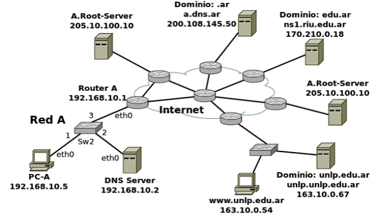

# Practica 3 - Capa de Aplicación DNS (Domain Name Server)

1. ## Investigue y describa cómo funciona el DNS. ¿Cuál es su objetivo?

    DNS son las iniciales de Domain Name System (sistema de nombres de dominio) y es una tecnología basada en una base de datos que sirve para resolver nombres en las redes, es decir, para conocer la dirección IP de la máquina donde está alojado el dominio al que queremos acceder.

    La resolución de nombres utiliza una estructura en árbol, mediante la cual los diferentes servidores DNS de las zonas de autoridad se encargan de resolver las direcciones de su zona, y si no se lo solicitan a otro servidor que creen que conoce la dirección.

2. ## ¿Qué es un root server? ¿Qué es un generic top-level domain (gtld)?

    Un servidor raíz (root server en inglés) es un servidor de nombres para la zona raíz del Sistema de nombres de dominio de Internet (DNS). Los servidores de nombres raíz son una parte fundamental de Internet, ya que son el primer paso en la traducción (resolución) de los nombres de host legibles en direcciones IP que se utilizan en la comunicación entre los hosts de Internet.

    Un dominio de nivel superior o TLD (del inglés top-level domain) es la más alta categoría de los FQDN que es traducida a direcciones IP por los DNS oficiales de Internet. Los nombres servidos por los DNS oficiales son administrados por la Internet Corporation for Assigned Names and Numbers (ICANN). Alternativamente a los DNS oficiales, hay una serie de servicios de DNS alternativos, como es OpenNIC.

    Un dominio de nivel superior genérico (generic Top Level Domain o gTLD) es una de las categorías de dominios de nivel superior que mantiene la Internet Assigned Numbers Authority (IANA) para su uso en el sistema de nombres de dominio de Internet. Es visible para los usuarios de Internet como el sufijo al final de un nombre de dominio (ej: .com).

3. ## ¿Qué es una respuesta del tipo autoritativa?

    Un servidor DNS autoritativo es aquel que tiene una respuesta en su base de datos local para un dominio sobre el que se le pregunte. Es en estos proveedores donde se crean los registros DNS que después conformarán el contenido de lo que es un servidor DNS.

4. ## ¿Qué diferencia una consulta DNS recursiva de una iterativa?

    En una consulta recursiva, un cliente solicita a un servidor DNS que obtenga por sí mismo la respuesta completa (es decir, dado el dominio mi.dominio.com, el cliente espera recibir la dirección IP correspondiente). Por otro lado, dada una consulta iterativa, el servidor DNS no otorga una respuesta completa: para el caso de mi.dominio.com, el primer servidor al que se le realiza la consulta (un servidor raíz), retorna las direcciones IP de los servidores de nivel superior (TDL) responsables del dominio .com. De este modo, el cliente ahora debe realizar una nueva consulta a uno de estos servidores, el cual toma nota del sufijo .dominio.com y responde con la IP del servidor DNS correspondiente, por ejemplo dns.dominio.com. Finalmente, el cliente envía una nueva consulta a dns.dominio.com para obtener la dirección IP de mi.dominio.com

5. ## ¿Qué es el resolver?

    Un resolver es una parte del sistema operativo que se encarga de realizar las consultas a un servidor DNS, interpretarlas y devolverlas al programa que ha efectuado la consulta. Los servidores DNS también pueden incorporar un resolver, que gestiona las consultas que un servidor DNS debe hacer.

    Un resolver siempre suele hacer consultas recursivas exclusivamente.

6. ## Describa para qué se utilizan los siguientes tipos de registros de DNS

    - ### a. A

        El registro “A” hace referencia a la Dirección y es el tipo más básico de sintaxis de DNS. Indica la dirección de IP real de un dominio.


    - ### b. MX

        El registro “MX” o intercambio de correo es principalmente una lista de servidores de intercambio de correo que se debe utilizar para el dominio.


    - ### c. PTR

        El registro “PTR” significa “Punto de Terminación de Red”. La sintaxis de DNS es responsable del mapeo de una dirección IPv4 para el CNAME en el alojamiento.

    - ### d. AAAA

        El registro “AAAA” (también conocido como dirección IPv6) indica el nombre de alojamiento a una dirección IPv6 de 128 bits. Las direcciones DNS normales se mapean para direcciones IPv4 de 32 bits.


    - ### e. SRV

        Un registro “SRV” significa “Servicio”. Se utiliza para la definición de un servicio TCP en el que opera el dominio.

    - ### f. NS

        El registro “NS” significa Servidor de nombres e indica que nombre del servidor es el autorizado para el dominio.

    - ### g. CNAME

        El registro “CNAME” significa nombre canónico y su función es hacer que un dominio sea un alias para otro. El CNAME generalmente se utiliza para asociar nuevos subdominios con dominios ya existentes de registro A.

    - ### h. SOA

        Un registro “SOA” significa “Comienzo de Autoridad”. Evidentemente, es uno de los registros DNS más importantes, dado que guarda información esencial, como la fecha de la última actualización del dominio y otros cambios y actividades.

    - ### i. TXT

        Un registro “TXT” significa “Texto”. Esta sintaxis de DNS permite que los administradores inserten texto en el registro DNS. A menudo se utiliza para denotar hechos o información sobre el dominio.

7. ## En Internet, un dominio suele tener más de un servidor DNS, ¿por qué cree que esto es así?

    Los dominios suelen tener más de un servidor ya que puede haber una falla y al tener varios servidores se evita el perder el dominio.

8. ## Cuando un dominio cuenta con más de un servidor, uno de ellos es el primario (o maestro) y todos los demás son secundarios (o esclavos). ¿Cuál es la razón de que sea así?

    Los dominios se implementan como clusters de servidores donde un servidor maestro guarda la información sobre una zona determinada del espacio de nombres de dominio en su propia base de datos. Cuando la información de un servidor de nombres que no procede de los archivos de zona propios, sino que son de segunda o de tercera mano, este servidor se convierte en secundario o esclavo para esta información.

    Esto se produce cuando un servidor no puede resolver la petición con la información de su base de datos y ha de recurrir a la información disponible en otro servidor de nombres (resolución recursiva).

    La información que contienen los servidores esclavos puede no ser segura ya que pueden haber cambiado las entradas en el archivo de zona en el ínterin.

9. ## Explique brevemente en qué consiste el mecanismo de transferencia de zona y cuál es su finalidad

    Es uno de los varios mecanismos disponibles para replicar bases de datos DNS a través de un conjunto de servidores DNS. Se producirá una transferencia de zona durante cualquiera de los siguientes escenarios:

    - Al iniciar el servicio DNS en el servidor DNS secundario.
    - Cuando caduca el tiempo de actualización.
    - Cuando se guardan los cambios en el archivo de zona principal y hay una notificación lista.

    Una transferencia de zona utiliza el protocolo TCP para el transporte, y toma la forma de una transacción de cliente-servidor. El cliente que solicita una transferencia de zona puede ser un servidor esclavo o servidor secundario, que solicita datos de un servidor maestro, a veces llamado un servidor primario. La parte de la base de datos que se replica es una zona.

10. ## Imagine que usted es el administrador del dominio de DNS de la UNLP (unlp.edu.ar). A su vez, cada facultad de la UNLP cuenta con un administrador que gestiona su propio dominio (por ejemplo, en el caso de la Facultad de Informática se trata de info.unlp.edu.ar). Suponga que se crea una nueva facultad, Facultad de Redes, cuyo dominio será redes.unlp.edu.ar, y el administrador le indica que quiere poder manejar su propio dominio. ¿Qué debe hacer usted para que el administrador de la Facultad de Redes pueda gestionar el dominio de forma independiente? (Pista: investigue en qué consiste la delegación de dominios). Indicar qué registros de DNS se deberían agregar

    Para que el administrador de la Facultad de Redes pueda gestionar su dominio de forma independiente, se debe definir el espacio de dominio y su administración y luego es necesario delegarlo al servidor unlp.edu.ar de manera distribuida. La delegación consiste en saber las direcciones IP de los servidores que se encargan de resolver (o sub-delegar) las zonas de manera autoritativa.

    Para esto, se deben agregar registros NS (Name Server) en el servidor unlp.edu.ar que apunten a los servidores DNS de la Facultad de Redes, y también se deben agregar registros A (Address) para asociar los nombres de los servidores DNS de la Facultad de Redes con sus respectivas direcciones IP. De esta manera, cuando alguien intente resolver un dominio bajo redes.unlp.edu.ar, el servidor unlp.edu.ar sabrá que debe consultar a los servidores DNS de la Facultad de Redes para obtener la información necesaria.

11. ## Responda y justifique los siguientes ejercicios

    - ### a. En la VM, utilice el comando dig para obtener la dirección IP del host <www.redes.unlp.edu.ar> y responda

        ``` bash
        dig www.redes.unlp.edu.ar

        ; <<>> DiG 9.16.27-Debian <<>> www.redes.unlp.edu.ar
        ;; global options: +cmd
        ;; Got answer:
        ;; ->>HEADER<<- opcode: QUERY, status: NOERROR, id: 31965
        ;; flags: qr aa rd ra; QUERY: 1, ANSWER: 1, AUTHORITY: 0, ADDITIONAL: 1

        ;; OPT PSEUDOSECTION:
        ; EDNS: version: 0, flags:; udp: 1232
        ; COOKIE: 421d32ee557125dc010000006a32ceb4ef70070642f2a4d4 (good)
        ;; QUESTION SECTION:
        ;www.redes.unlp.edu.ar.		IN	A

        ;; ANSWER SECTION:
        www.redes.unlp.edu.ar.	300	IN	A	172.28.0.50

        ;; Query time: 4 msec
        ;; SERVER: 172.28.0.29#53(172.28.0.29)
        ;; WHEN: Wed Jun 17 13:43:32 -03 2026
        ;; MSG SIZE  rcvd: 94
        ```
        - #### i. ¿La solicitud fue recursiva? ¿Y la respuesta? ¿Cómo lo sabe?

            Si, la solicitud fue recursiva ya que el flag rd (recursion desired) está presente en la respuesta. La respuesta también es recursiva, dado que el flag ra (recursion available) también está presente.

        - #### ii. ¿Puede indicar si se trata de una respuesta autoritativa? ¿Qué significa que lo sea?

            Sí, se trata de una respuesta autoritativa, dado que el flag aa (authoritative answer) está presente en la respuesta. Esto significa que el servidor DNS que respondió a la consulta es el servidor autoritativo para el dominio www.redes.unlp.edu.ar, lo que implica que tiene la información más actualizada y confiable sobre ese dominio.

        - #### iii. ¿Cuál es la dirección IP del resolver utilizado? ¿Cómo lo sabe?

            La dirección IP del resolver utilizado es 172.28.0.29. Esto se puede saber porque en la sección "SERVER" de la respuesta se indica que el servidor que respondió a la consulta es 172.28.0.29.

    - ### b. ¿Cuáles son los servidores de correo del dominio redes.unlp.edu.ar? ¿Por qué hay más de uno y qué significan los números que aparecen entre MX y el nombre? Si se quiere enviar un correo destinado a redes.unlp.edu.ar, ¿a qué servidor se le entregará? ¿En qué situación se le entregará al otro?

        ```bash
        dig mx redes.unlp.edu.ar +short

        5 mail.redes.unlp.edu.ar.
        10 mail2.redes.unlp.edu.ar.
        ```

        Los servidores de correo del dominio redes.unlp.edu.ar son mail.redes.unlp.edu.ar y mail2.redes.unlp.edu.ar. Hay más de uno para garantizar la disponibilidad y redundancia en caso de que uno de los servidores falle. Los números que aparecen entre MX y el nombre indican la prioridad del servidor de correo, siendo el número más bajo el de mayor prioridad. Si se quiere enviar un correo destinado a redes.unlp.edu.ar, se le entregará al servidor mail.redes.unlp.edu.ar, ya que tiene la prioridad más alta (5). Si ese servidor no está disponible, entonces se le entregará al otro servidor mail2.redes.unlp.edu.ar, que tiene una prioridad de 10.

    - ### c. ¿Cuáles son los servidores de DNS del dominio redes.unlp.edu.ar?

        ```bash
        dig ns redes.unlp.edu.ar +short

         <<>> DiG 9.16.27-Debian <<>> ns redes.unlp.edu.ar
        ;; global options: +cmd
        ;; Got answer:
        ;; ->>HEADER<<- opcode: QUERY, status: NOERROR, id: 53762
        ;; flags: qr aa rd ra; QUERY: 1, ANSWER: 2, AUTHORITY: 0, ADDITIONAL: 3

        ;; OPT PSEUDOSECTION:
        ; EDNS: version: 0, flags:; udp: 1232
        ; COOKIE: 44e2d76afeea13e7010000006a32d0e48f9bc325212df687 (good)
        ;; QUESTION SECTION:
        ;redes.unlp.edu.ar.		IN	NS

        ;; ANSWER SECTION:
        redes.unlp.edu.ar.	86400	IN	NS	ns-sv-b.redes.unlp.edu.ar.
        redes.unlp.edu.ar.	86400	IN	NS	ns-sv-a.redes.unlp.edu.ar.

        ;; ADDITIONAL SECTION:
        ns-sv-a.redes.unlp.edu.ar. 604800 IN	A	172.28.0.30
        ns-sv-b.redes.unlp.edu.ar. 604800 IN	A	172.28.0.29

        ;; Query time: 4 msec
        ;; SERVER: 172.28.0.29#53(172.28.0.29)
        ;; WHEN: Wed Jun 17 13:52:52 -03 2026
        ;; MSG SIZE  rcvd: 150

        ```

    - ### d. Repita la consulta anterior cuatro veces más. ¿Qué observa? ¿Puede explicar a qué se debe?

        Se puede observar:

        - Cambia el ID de la consulta
        - Cambuia el orden de los servidores de DNS que aparecen en la respuesta
        - Cammbia COOKIE
        - El TTL y NS son los mismos
        - Cambia el valor When de la consutla
        - Cmabia el Query time

        Esto se debe a que el servidor DNS está utilizando un mecanismo de balanceo de carga para distribuir las consultas entre los servidores de DNS disponibles. Al cambiar el orden de los servidores de DNS en la respuesta, el servidor DNS puede dirigir las consultas a diferentes servidores en cada consulta, lo que ayuda a distribuir la carga y mejorar el rendimiento del sistema DNS. Además, el cambio en el ID de la consulta y la COOKIE es parte del proceso normal de generación de consultas DNS para garantizar la seguridad y la integridad de las respuestas.

    - ### e. Observe la información que obtuvo al consultar por los servidores de DNS del dominio. En base a la salida, ¿es posible indicar cuál de ellos es el primario?

        No, no es posible indicar cuál de los servidores de DNS es el primario solo con la información obtenida al consultar por los servidores de DNS del dominio. La consulta por los servidores de DNS (registro NS) solo proporciona información sobre los servidores que están autorizados para el dominio, pero no indica cuál de ellos es el primario o maestro. Para determinar cuál es el servidor primario, se necesitaría consultar el registro SOA (Start of Authority) del dominio, que contiene información sobre el servidor primario y otros detalles relacionados con la zona DNS.

    - ### f. Consulte por el registro SOA del dominio y responda

        ```bash
        redes@debian:~$ dig soa redes.unlp.edu.ar

        ; <<>> DiG 9.16.27-Debian <<>> soa redes.unlp.edu.ar
        ;; global options: +cmd
        ;; Got answer:
        ;; ->>HEADER<<- opcode: QUERY, status: NOERROR, id: 62922
        ;; flags: qr aa rd ra; QUERY: 1, ANSWER: 1, AUTHORITY: 0, ADDITIONAL: 1

        ;; OPT PSEUDOSECTION:
        ; EDNS: version: 0, flags:; udp: 1232
        ; COOKIE: 9c32fc9c6b3ef0c1010000006a32d244730fd906c6047124 (good)
        ;; QUESTION SECTION:
        ;redes.unlp.edu.ar.		IN	SOA

        ;; ANSWER SECTION:
        redes.unlp.edu.ar.	86400	IN	SOA	ns-sv-b.redes.unlp.edu.ar. root.redes.unlp.edu.ar. 2020031700 604800 86400 2419200 86400

        ;; Query time: 4 msec
        ;; SERVER: 172.28.0.29#53(172.28.0.29)
        ;; WHEN: Wed Jun 17 13:58:44 -03 2026
        ;; MSG SIZE  rcvd: 123
        ```


        - #### i. ¿Puede ahora determinar cuál es el servidor de DNS primario?

            Sí, ahora se puede determinar que el servidor de DNS primario es ns-sv-b.redes.unlp.edu.ar, ya que es el servidor que aparece en el registro SOA como el servidor de nombres principal para la zona redes.unlp.edu.ar.

        - #### ii. ¿Cuál es el número de serie, qué convención sigue y en qué casos es importante actualizarlo?

            El número de serie es 2020031700. La convención que sigue es YYYYMMDDNN, donde YYYY es el año, MM es el mes, DD es el día y NN es un número de dos dígitos que se incrementa cada vez que se realiza una actualización en el mismo día. Es importante actualizar el número de serie cada vez que se realice un cambio en la zona DNS, ya que los servidores secundarios utilizan este número para determinar si necesitan actualizar su copia de la zona. Si el número de serie no se actualiza correctamente, los servidores secundarios pueden no recibir las actualizaciones y servir información obsoleta a los clientes.

        - #### iii. ¿Qué valor tiene el segundo campo del registro? Investigue para qué se usa y cómo se interpreta el valor.

            El segundo campo del registro SOA es 604800, que representa el tiempo de actualización (refresh) en segundos. Este valor indica con qué frecuencia los servidores secundarios deben consultar al servidor primario para verificar si hay cambios en la zona DNS. En este caso, el valor de 604800 segundos equivale a 7 días, lo que significa que los servidores secundarios deben verificar con el servidor primario una vez cada semana para asegurarse de que tienen la información más actualizada.

        - #### iv. ¿Qué valor tiene el TTL de caché negativa y qué significa?

            El valor del TTL de caché negativa es 86400 segundos, que equivale a 24 horas. Esto significa que si un servidor DNS realiza una consulta para un nombre de dominio que no existe en la zona y recibe una respuesta negativa (NXDOMAIN), el servidor DNS almacenará esa respuesta en su caché durante 24 horas antes de volver a consultar al servidor primario para verificar si el nombre de dominio ha sido creado o actualizado. Durante este tiempo, cualquier consulta para ese nombre de dominio resultará en una respuesta negativa sin consultar al servidor primario, lo que ayuda a reducir la carga en el servidor primario y mejorar el rendimiento del sistema DNS.

    - ### g. Indique qué valor tiene el registro TXT para el nombre saludo.redes.unlp.edu.ar. Investigue para qué es usado este registro.

        ```bash
        dig -t txt saludo.redes.unlp.edu.ar +short
        "HOLA"
        ```

        El valor del registro TXT para el nombre saludo.redes.unlp.edu.ar es "HOLA". El registro TXT se utiliza para almacenar información de texto asociada a un nombre de dominio. Este tipo de registro puede ser utilizado para diversos propósitos, como la verificación de propiedad de un dominio, la configuración de políticas de seguridad (por ejemplo, SPF para correo electrónico), o simplemente para proporcionar información adicional sobre el dominio. En este caso, el registro TXT parece ser utilizado para proporcionar un mensaje de saludo, aunque su uso específico dependerá del contexto en el que se haya configurado.

    - ### h. Utilizando dig, solicite la transferencia de zona de redes.unlp.edu.ar, analice la salida y responda.

        ```bash
        dig redes.unlp.edu.ar axfr

        ; <<>> DiG 9.16.27-Debian <<>> redes.unlp.edu.ar axfr
        ;; global options: +cmd
        redes.unlp.edu.ar.	86400	IN	SOA	ns-sv-b.redes.unlp.edu.ar. root.redes.unlp.edu.ar. 2020031700 604800 86400 2419200 86400
        redes.unlp.edu.ar.	86400	IN	NS	ns-sv-a.redes.unlp.edu.ar.
        redes.unlp.edu.ar.	86400	IN	NS	ns-sv-b.redes.unlp.edu.ar.
        redes.unlp.edu.ar.	86400	IN	MX	5 mail.redes.unlp.edu.ar.
        redes.unlp.edu.ar.	86400	IN	MX	10 mail2.redes.unlp.edu.ar.
        ftp.redes.unlp.edu.ar.	86400	IN	CNAME	www.redes.unlp.edu.ar.
        mail.redes.unlp.edu.ar.	86400	IN	A	172.28.0.90
        mail2.redes.unlp.edu.ar. 86400	IN	A	172.28.0.91
        ns-sv-a.redes.unlp.edu.ar. 604800 IN	A	172.28.0.30
        ns-sv-b.redes.unlp.edu.ar. 604800 IN	A	172.28.0.29
        practica.redes.unlp.edu.ar. 86400 IN	NS	ns1.practica.redes.unlp.edu.ar.
        practica.redes.unlp.edu.ar. 86400 IN	NS	ns2.practica.redes.unlp.edu.ar.
        ns1.practica.redes.unlp.edu.ar.	86400 IN A	172.28.0.120
        ns2.practica.redes.unlp.edu.ar.	86400 IN A	172.28.0.121
        saludo.redes.unlp.edu.ar. 86400	IN	TXT	"HOLA"
        www.redes.unlp.edu.ar.	300	IN	A	172.28.0.50
        redes.unlp.edu.ar.	86400	IN	SOA	ns-sv-b.redes.unlp.edu.ar. root.redes.unlp.edu.ar. 2020031700 604800 86400 2419200 86400
        ;; Query time: 8 msec
        ;; SERVER: 172.28.0.29#53(172.28.0.29)
        ;; WHEN: Wed Jun 17 18:52:05 -03 2026
        ;; XFR size: 17 records (messages 1, bytes 441)
        ```

        - #### i. ¿Qué significan los números que aparecen antes de la palabra IN? ¿Cuál es su finalidad?

            Los números que aparecen antes de la palabra IN representan el TTL (Time to Live) de cada registro DNS. El TTL indica el tiempo en segundos que un registro puede ser almacenado en caché por los servidores DNS antes de que se considere obsoleto y se deba realizar una nueva consulta al servidor autoritativo para obtener la información actualizada. La finalidad del TTL es mejorar la eficiencia del sistema DNS al reducir la cantidad de consultas que deben realizarse a los servidores autoritativos, permitiendo que los registros se almacenen temporalmente en caché y se reutilicen durante el tiempo especificado.

        - #### ii. ¿Cuántos registros NS observa? Compare la respuesta con los servidores de DNS del dominio redes.unlp.edu.ar que dio anteriormente. ¿Puede explicar a qué se debe la diferencia y qué significa?

            Se observan 4 registros NS en la transferencia de zona: ns-sv-a.redes.unlp.edu.ar, ns-sv-b.redes.unlp.edu.ar, ns1.practica.redes.unlp.edu.ar y ns2.practica.redes.unlp.edu.ar. Anteriormente, al consultar los servidores de DNS del dominio redes.unlp.edu.ar, se obtuvieron solo 2 registros NS: ns-sv-a.redes.unlp.edu.ar y ns-sv-b.redes.unlp.edu.ar.

            La diferencia se debe a que la transferencia de zona incluye todos los registros NS que están configurados para el dominio, incluyendo aquellos que son delegados a subdominios (como practica.redes.unlp.edu.ar). Esto significa que los registros NS adicionales (ns1 y ns2) son responsables de manejar las consultas para el subdominio practica.redes.unlp.edu.ar, mientras que los registros NS originales (ns-sv-a y ns-sv-b) son responsables del dominio principal redes.unlp.edu.ar. En resumen, la transferencia de zona proporciona una visión completa de todos los servidores de nombres asociados con el dominio y sus subdominios.

    - ### i. Consulte por el registro A de <www.redes.unlp.edu.ar> y luego por el registro A de <www.practica.redes.unlp.edu.ar>. Observe los TTL de ambos. Repita la operación y compare el valor de los TTL de cada uno respecto de la respuesta anterior. ¿Puede explicar qué está ocurriendo? (Pista: observar los flags será de ayuda).

        ```bash
        dig a www.redes.unlp.edu.ar

        ;; ANSWER SECTION:
        www.redes.unlp.edu.ar.	300	IN	A	172.28.0.50
        ```

        ```bash
        dig a www.practica.redes.unlp.edu.ar

        ;; ANSWER SECTION:
        www.practica.redes.unlp.edu.ar.	60 IN	A	172.28.0.10
        ```

    - ### j. Consulte por el registro A de <www.practica2.redes.unlp.edu.ar>. ¿Obtuvo alguna respuesta? Investigue sobre los códigos de respuesta de DNS. ¿Para qué son utilizados los mensajes NXDOMAIN y NOERROR?

        ```bash
        dig a www.practica2.redes.unlp.edu.ar

        ; <<>> DiG 9.16.27-Debian <<>> a www.practica2.redes.unlp.edu.ar
        ;; global options: +cmd
        ;; Got answer:
        ;; ->>HEADER<<- opcode: QUERY, status: NXDOMAIN, id: 22944
        ;; flags: qr aa rd ra; QUERY: 1, ANSWER: 0, AUTHORITY: 1, ADDITIONAL: 1

        ;; OPT PSEUDOSECTION:
        ; EDNS: version: 0, flags:; udp: 1232
        ; COOKIE: a8d0149985c8717a010000006a3317e2e6055cd5e0b2d8b3 (good)
        ;; QUESTION SECTION:
        ;www.practica2.redes.unlp.edu.ar. IN	A

        ;; AUTHORITY SECTION:
        redes.unlp.edu.ar.	86400	IN	SOA	ns-sv-b.redes.unlp.edu.ar. root.redes.unlp.edu.ar. 2020031700 604800 86400 2419200 86400

        ;; Query time: 0 msec
        ;; SERVER: 172.28.0.29#53(172.28.0.29)
        ;; WHEN: Wed Jun 17 18:55:46 -03 2026
        ;; MSG SIZE  rcvd: 154
        ```

        No se obtuvo ninguna respuesta para el registro A de <www.practica2.redes.unlp.edu.ar>, y el código de respuesta fue NXDOMAIN. El mensaje NXDOMAIN (Non-Existent Domain) indica que el nombre de dominio consultado no existe en la zona DNS, es decir, no hay registros asociados a ese nombre de dominio. Por otro lado, el mensaje NOERROR indica que la consulta fue procesada correctamente y que se encontró una respuesta válida para el nombre de dominio consultado. En resumen, NXDOMAIN se utiliza para indicar que un dominio no existe, mientras que NOERROR se utiliza para indicar que la consulta fue exitosa y se encontró una respuesta válida.

12. ## Investigue los comandos nslookup y host. ¿Para qué sirven? Intente con ambos comandos obtener:

    - Dirección IP de www.redes.unlp.edu.ar.
    - Servidores de correo del dominio redes.unlp.edu.ar.
    - Servidores de DNS del dominio redes.unlp.edu.ar.

    - ### nslookup

        ```bash
        nslookup www.redes.unlp.edu.ar
        Server:		172.28.0.29
        Address:	172.28.0.29#53

        Name:	www.redes.unlp.edu.ar
        Address: 172.28.0.50


        nslookup -type=mx redes.unlp.edu.ar
        Server:		172.28.0.29
        Address:	172.28.0.29#53

        redes.unlp.edu.ar	mail exchanger = 5 mail.redes.unlp.edu.ar.
        redes.unlp.edu.ar	mail exchanger = 10 mail2.redes.unlp.edu.ar.

        nslookup -type=ns redes.unlp.edu.ar
        Server:		172.28.0.29
        Address:	172.28.0.29#53

        redes.unlp.edu.ar	mail exchanger = 5 mail.redes.unlp.edu.ar.
        redes.unlp.edu.ar	mail exchanger = 10 mail2.redes.unlp.edu.ar.
        ```

    - ### host

        ```bash
        host www.redes.unlp.edu.ar
        www.redes.unlp.edu.ar has address 172.28.0.50

        host -t mx redes.unlp.edu.ar
        redes.unlp.edu.ar mail is handled by 10 mail2.redes.unlp.edu.ar.
        redes.unlp.edu.ar mail is handled by 5 mail.redes.unlp.edu.ar.

        host -t ns redes.unlp.edu.ar
        redes.unlp.edu.ar name server ns-sv-b.redes.unlp.edu.ar.
        redes.unlp.edu.ar name server ns-sv-a.redes.unlp.edu.ar.
        ```

13. ## ¿Qué función cumple en Linux/Unix el archivo /etc/hosts o en Windows el archivo \WINDOWS\system32\drivers\etc\hosts?

    El archivo /etc/hosts en Linux/Unix y el archivo \WINDOWS\system32\drivers\etc\hosts en Windows sirven como una tabla de resolución de nombres local que asigna nombres de dominio a direcciones IP. Esta tabla se utiliza para resolver nombres de dominio sin necesidad de consultar un servidor DNS, lo que puede mejorar el rendimiento y proporcionar una forma de redirigir solicitudes a direcciones IP específicas.

14. ## Abra el programa Wireshark para comenzar a capturar el tráfico de red en la interfaz con IP 172.28.0.1. Una vez abierto realice una consulta DNS con el comando dig para averiguar el registro MX de redes.unlp.edu.ar y luego, otra para averiguar los registros NS correspondientes al dominio redes.unlp.edu.ar. Analice la información proporcionada por dig y compárelo con la captura.

    Devuelven la misma información, ya que el comando dig realiza consultas DNS y la captura de Wireshark muestra el tráfico de red, incluyendo las consultas DNS realizadas por dig. Al analizar la captura de Wireshark, se pueden observar los paquetes DNS que contienen las consultas para los registros MX y NS de redes.unlp.edu.ar, así como las respuestas correspondientes que contienen la información solicitada. Esto permite verificar que las consultas realizadas por dig están siendo procesadas correctamente por el servidor DNS y que las respuestas contienen la información esperada.

15. ## Dada la siguiente situación: “Una PC en una red determinada, con acceso a Internet, utiliza los servicios de DNS de un servidor de la red”. Analice:

    - ### a. ¿Qué tipo de consultas (iterativas o recursivas) realiza la PC a su servidor de DNS?

        La PC realiza consultas recursivas a su servidor de DNS. En una consulta recursiva, la PC solicita al servidor de DNS que resuelva completamente el nombre de dominio y devuelva la dirección IP correspondiente. El servidor de DNS se encargará de realizar las consultas necesarias a otros servidores de DNS para obtener la información requerida y luego devolverá la respuesta completa a la PC.


    - ### b. ¿Qué tipo de consultas (iterativas o recursivas) realiza el servidor de DNS para resolver requerimientos de usuario como el anterior? ¿A quién le realiza estas consultas?

        El servidor de DNS realiza consultas iterativas para resolver los requerimientos de usuario. En una consulta iterativa, el servidor de DNS no resuelve completamente el nombre de dominio, sino que devuelve la dirección IP del siguiente servidor de DNS que debe ser consultado para continuar con la resolución. El servidor de DNS realiza estas consultas a otros servidores de DNS en la jerarquía del sistema DNS, comenzando por los servidores raíz, luego los servidores de nivel superior (TLD) y finalmente los servidores autoritativos para el dominio específico que se está consultando.

16. ## Relacione DNS con HTTP. ¿Se puede navegar si no hay servicio de DNS?

    DNS y HTTP son dos protocolos diferentes que cumplen funciones distintas en la comunicación en Internet. DNS se encarga de resolver nombres de dominio en direcciones IP, mientras que HTTP es el protocolo utilizado para la transferencia de datos en la web. Sin embargo, ambos protocolos están estrechamente relacionados, ya que para acceder a un sitio web utilizando HTTP, es necesario resolver el nombre de dominio del sitio web a través de DNS para obtener su dirección IP.

    Si no hay servicio de DNS disponible, no se podrá navegar utilizando nombres de dominio, ya que el navegador no podrá resolver los nombres de dominio a direcciones IP. Sin embargo, si se conoce la dirección IP del sitio web al que se desea acceder, se podría ingresar directamente esa dirección IP en el navegador para acceder al sitio web sin necesidad de utilizar DNS.

17. ## Observar el siguiente gráfico y contestar:

    

    - ### a. Si la PC-A, que usa como servidor de DNS a "DNS Server", desea obtener la IP de www.unlp.edu.ar, cuáles serían, y en qué orden, los pasos que se ejecutarán para obtener la respuesta.

        1. PC-A consulta en su resolver local para obtener la dirección IP de `www.unlp.edu.ar`.
        2. Si no la encuentra en su caché, PC-A envía una consulta recursiva al "DNS Server" para resolver `www.unlp.edu.ar`.
        3. El "DNS Server" recibe la consulta y verifica si tiene la información en su caché. Si no la tiene, el "DNS Server" envía una consulta iterativa al servidor raíz (`A.Root-Server / 205.10.100.10`) para obtener la dirección IP del servidor de nombres autoritativo para el dominio .ar.
        4. El servidor raíz responde con la dirección IP del servidor de nombres autoritativo para el dominio .ar. `a.dns.ar / 200.108.145.50`
        5. El "DNS Server" envía una consulta iterativa al servidor de nombres autoritativo para el dominio .ar
        6. El servidor de nombres autoritativo para el dominio .ar responde con la dirección IP del servidor de nombres .edu.ar. `ns1.riu.edu.ar / 170.210.0.18`
        7. El "DNS Server" envía una consulta iterativa al servidor de nombres .edu.ar para obtener la dirección IP del servidor de nombres autoritativo para el dominio unlp.edu.ar.
        8. El servidor de nombres autoritativo para el dominio .edu.ar responde con la dirección IP del servidor de nombres autoritativo para el dominio unlp.edu.ar. `unlp.unlp.edu.ar / 163.10.0.67`
        9. El "DNS Server" envía una consulta iterativa al servidor de nombres autoritativo para el dominio unlp.edu.ar para obtener la dirección IP de `www.unlp.edu.ar`.
        10. El servidor de nombres autoritativo para el dominio unlp.edu.ar responde con la dirección IP de `www.unlp.edu.ar`. `www.unlp.edu.ar / 163.10.0.54`

    - ### b. ¿Dónde es recursiva la consulta? ¿Y dónde iterativa?
        La consulta es recursiva entre PC-A y el "DNS Server", ya que PC-A solicita al "DNS Server" que resuelva completamente el nombre de dominio `www.unlp.edu.ar` y devuelva la dirección IP correspondiente. Por otro lado, las consultas entre el "DNS Server" y los servidores raíz, de nivel superior y autoritativos son iterativas, ya que el "DNS Server" no resuelve completamente el nombre de dominio, sino que devuelve la dirección IP del siguiente servidor de DNS que debe ser consultado para continuar con la resolución.

18. ## ¿A quién debería consultar para que la respuesta sobre www.google.com sea autoritativa?

    Para obtener una respuesta autoritativa sobre www.google.com, se debería consultar al servidor de nombres autoritativo para el dominio google.com. Este servidor es responsable de mantener la información actualizada sobre el dominio google.com y puede proporcionar una respuesta autoritativa con la dirección IP correspondiente a www.google.com.

    ```bash
    dig ns google.com

    ;; flags: qr rd ra; QUERY: 1, ANSWER: 4, AUTHORITY: 0, ADDITIONAL: 9


    google.com.		172753	IN	NS	ns4.google.com.
    google.com.		172753	IN	NS	ns1.google.com.
    google.com.		172753	IN	NS	ns2.google.com.
    google.com.		172753	IN	NS	ns3.google.com.

    ```

    Como en la respuesta no está el flag aa (authoritative answer), se puede concluir que la respuesta no es autoritativa. Para obtener una respuesta autoritativa, se debería consultar directamente a uno de los servidores de nombres autoritativos para el dominio google.com, como ns1.google.com, ns2.google.com, ns3.google.com o ns4.google.com.

    ```bash
    dig @ns1.google.com www.google.com

    ;; flags: qr aa rd; QUERY: 1, ANSWER: 1, AUTHORITY: 0, ADDITIONAL: 1

    google.com.		300	IN	A	142.251.128.46
    ```

19. ## ¿Qué sucede si al servidor elegido en el paso anterior se lo consulta por www.info.unlp.edu.ar? ¿Y si la consulta es al servidor 8.8.8.8?

    ```bash
    dig www.info.unlp.edu.ar @ns1.google.com

    ; <<>> DiG 9.16.27-Debian <<>> www.info.unlp.edu.ar @ns1.google.com
    ;; global options: +cmd
    ;; Got answer:
    ;; ->>HEADER<<- opcode: QUERY, status: REFUSED, id: 35215
    ;; flags: qr rd; QUERY: 1, ANSWER: 0, AUTHORITY: 0, ADDITIONAL: 1
    ;; WARNING: recursion requested but not available

    ;; OPT PSEUDOSECTION:
    ; EDNS: version: 0, flags:; udp: 512
    ;; QUESTION SECTION:
    ;www.info.unlp.edu.ar.		IN	A

    ;; Query time: 47 msec
    ;; SERVER: 216.239.32.10#53(216.239.32.10)
    ;; WHEN: Wed Jun 17 19:51:35 -03 2026
    ;; MSG SIZE  rcvd: 49
    ```

    Al consultar por www.info.unlp.edu.ar al servidor ns1.google.com, se obtiene una respuesta con el código de estado REFUSED, lo que indica que el servidor ha rechazado la consulta. Esto se debe a que ns1.google.com no es un servidor autoritativo para el dominio info.unlp.edu.ar y, por lo tanto, no tiene la información necesaria para resolver esa consulta.

    ```bash
    dig www.info.unlp.edu.ar @8.8.8.8

    ; <<>> DiG 9.16.27-Debian <<>> www.info.unlp.edu.ar @8.8.8.8
    ;; global options: +cmd
    ;; Got answer:
    ;; ->>HEADER<<- opcode: QUERY, status: NOERROR, id: 23336
    ;; flags: qr rd ra; QUERY: 1, ANSWER: 1, AUTHORITY: 0, ADDITIONAL: 1

    ;; OPT PSEUDOSECTION:
    ; EDNS: version: 0, flags:; udp: 512
    ;; QUESTION SECTION:
    ;www.info.unlp.edu.ar.		IN	A

    ;; ANSWER SECTION:
    www.info.unlp.edu.ar.	300	IN	A	163.10.5.71

    ;; Query time: 67 msec
    ;; SERVER: 8.8.8.8#53(8.8.8.8)
    ;; WHEN: Wed Jun 17 19:52:10 -03 2026
    ;; MSG SIZE  rcvd: 65
    ```

    Al consultar por www.info.unlp.edu.ar al servidor 8.8.8.8, se obtiene una respuesta con el código de estado NOERROR, lo que indica que la consulta fue exitosa y el servidor tiene la información necesaria para resolverla.
