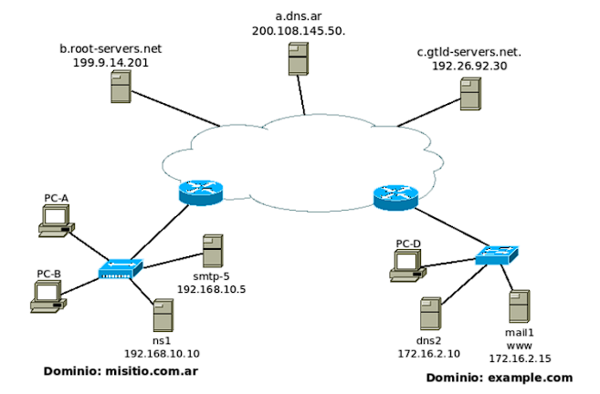

# Práctica 4 - Capa de Aplicación Correo Electrónico

1. ## ¿Qué protocolos se utilizan para el envío de mails entre el cliente y su servidor de correo? ¿Y entre servidores de correo?

    Para el envío de correos electrónicos, se utilizan principalmente dos protocolos:

    - **SMTP (Simple Mail Transfer Protocol)**: Es el protocolo estándar para el envío de correos electrónicos a través de Internet. SMTP se utiliza tanto para la comunicación entre el cliente de correo y su servidor de correo como para la comunicación entre servidores de correo. Este protocolo se encarga de la transferencia de mensajes desde el cliente al servidor y entre servidores, asegurando que los correos lleguen a su destino.

    - **ESMTP (Extended Simple Mail Transfer Protocol)**: Es una extensión de SMTP que añade funcionalidades adicionales, como la autenticación de usuarios y la capacidad de enviar mensajes con formatos más complejos. ESMTP es compatible con SMTP, pero ofrece características mejoradas para una mayor seguridad y eficiencia en el envío de correos electrónicos.

2. ## ¿Qué protocolos se utilizan para la recepción de mails? Enumere y explique características y diferencias entre las alternativas posibles

    Para la recepción de correos electrónicos, se utilizan principalmente dos protocolos:

    - **POP3 (Post Office Protocol version 3)**: Es un protocolo utilizado para la recepción de correos electrónicos. POP3 permite a los usuarios descargar sus correos electrónicos desde el servidor a su dispositivo local. Una vez que los correos son descargados, generalmente se eliminan del servidor, lo que significa que no se pueden acceder desde otros dispositivos. POP3 es sencillo y fácil de configurar, pero no es ideal para usuarios que necesitan acceder a sus correos desde múltiples dispositivos.

    - **IMAP (Internet Message Access Protocol)**: Es otro protocolo utilizado para la recepción de correos electrónicos. A diferencia de POP3, IMAP permite a los usuarios acceder y gestionar sus correos electrónicos directamente en el servidor. Esto significa que los correos permanecen en el servidor y pueden ser accedidos desde múltiples dispositivos sin necesidad de descargarlos. IMAP también ofrece características avanzadas como la organización de correos en carpetas y la sincronización en tiempo real entre dispositivos.

    En resumen, la principal diferencia entre POP3 e IMAP radica en cómo manejan los correos electrónicos: POP3 descarga y elimina los correos del servidor, mientras que IMAP mantiene los correos en el servidor y permite el acceso desde múltiples dispositivos.

3. ## Utilizando la VM y teniendo en cuenta los siguientes datos, abra el cliente de correo (Thunderbird) y configure dos cuentas de correo. Una de las cuentas utilizará POP para solicitar al servidor los mails recibidos para la misma mientras que la otra utilizará IMAP. Al ingresar a cada una de las cuentas, seleccionar Manual config y luego de configurar las mismas según lo indicado, ignorar advertencias por uso de conexión sin cifrado.

    - Datos para POP

        - Cuenta de correo: alumnopop@redes.unlp.edu.ar
        - Nombre de usuario: alumnopop
        - Contraseña: alumnopoppass
        - Puerto: 110

    - Datos para IMAP

        - Cuenta de correo: alumnoimap@redes.unlp.edu.ar
        - Nombre de usuario: alumnoimap
        - Contraseña: alumnoimappass
        - Puerto: 143

    - Datos comunes para ambas cuentas
        - Servidor de correo entrante (POP/IMAP):
            - Nombre: mail.redes.unlp.edu.ar
            - SSL: None
            - Autenticación: Normal password
        - Servidor de correo saliente (SMTP):
            - Nombre: mail.redes.unlp.edu.ar
            - Puerto: 25
            - SSL: None
            - Autenticación: Normal password

    - ### a. Verificar el correcto funcionamiento enviando un email desde el cliente de una cuenta a la otra y luego desde la otra responder el mail hacia la primera.
    - ### b. Análisis del protocolo SMTP
        - #### i. Utilizando Wireshark, capture el tráfico de red contra el servidor de correo mientras desde la cuenta alumnopop@redes.unlp.edu.ar envía un correo a alumnoimap@redes.unlp.edu.ar
        - #### ii. Utilice el filtro SMTP para observar los paquetes del protocolo SMTP en la captura generada y analice el intercambio de dicho protocolo entre el cliente y el servidor para observar los distintos comandos utilizados y su correspondiente respuesta. Ayuda: filtre por protocolo SMTP y sobre alguna de las líneas del intercambio haga click derecho y seleccione Follow TCP Stream. . .

    - ### c. Usando el cliente de correo Thunderbird del usuario alumnopop@redes.unlp.edu.ar envíe un correo electrónico alumnoimap@redes.unlp.edu.ar el cual debe tener: un asunto, datos en el body y una imagen adjunta.
        - #### i. Verifique las fuentes del correo recibido para entender cómo se utiliza el header “Content-Type: multipart/mixed“ para poder realizar el envío de distintos archivos adjuntos.
        - #### ii. Extraiga la imagen adjunta del mismo modo que lo hace el cliente de correo a partir de los fuentes del mensaje.
            Hay que extraerlo decodificando en base64.

4. ## Análisis del protocolo POP
    - ### a. Utilizando Wireshark, capture el tráfico de red contra el servidor de correo mientras desde la cuenta alumnoimap@redes.unlp.edu.ar le envía una correo a alumnopop@redes.unlp.edu.ar y mientras alumnopop@redes.unlp.edu.ar recepciona dicho correo.
    - ### b. Utilice el filtro POP para observar los paquetes del protocolo POP en la captura generada y analice el intercambio de dicho protocolo entre el cliente y el servidor para observar los distintos comandos utilizados y su correspondiente respuesta.

5. ## Análisis del protocolo IMAP
    - ### a. Utilizando Wireshark, capture el tráfico de red contra el servidor de correo mientras desde la cuenta alumnopop@redes.unlp.edu.ar le envía un correo a alumnoimap@redes.unlp.edu.ar y mientras alumnoimap@redes.unlp.edu.ar recepciona dicho correo.
    - ### b. Utilice el filtro IMAP para observar los paquetes del protocolo IMAP en la captura generada y analice el intercambio de dicho protocolo entre el cliente y el servidor para observar los distintos comandos utilizados y su correspondiente respuesta

6. ## IMAP vs POP

    - ### a. Marque como leídos todos los correos que tenga en el buzón de entrada de alumnopop y de alumnoimap. Luego, cree una carpeta llamada POP en la cuenta de alumnopop y una llamada IMAP en la cuenta de alumnoimap. Asegúrese que tiene mails en el inbox y en la carpeta recientemente creada en cada una de las cuentas.

    - ### b. Cierre la sesión de la máquina virtual del usuario redes e ingrese nuevamente identificándose como usuario root y password packer, ejecute el cliente de correos. De esta forma, iniciará el cliente de correo con el perfil del superusuario (diferente del usuario con el que ya configuró las cuentas antes mencionadas). Luego configure las cuentas POP e IMAP de los usuarios alumnopop y alumnoimap como se describió anteriormente pero desde el cliente de correos ejecutado con el usuario root. Responda:

        - #### i. ¿Qué correos ve en el buzón de entrada de ambas cuentas? ¿Están marcados como leídos o como no leídos? ¿Por qué?

            En el buzón de `alumnopop` puedo ver ambos coreros ninguno marcado como leido y en el buzón de `alumnoimap` puedo ver ambos correos pero ambos marcados como leidos. Esto se debe a que el protocolo POP descarga los correos al cliente y los elimina del servidor, por lo que al configurar la cuenta POP con el usuario root, no se descargaron los correos y permanecen en el servidor sin marcar como leídos. En cambio, el protocolo IMAP mantiene los correos en el servidor y sincroniza el estado de lectura entre los clientes, por lo que al configurar la cuenta IMAP con el usuario root, los correos ya estaban marcados como leídos en el servidor y se reflejó ese estado en el cliente.

        - #### ii. ¿Qué pasó con las carpetas POP e IMAP que creó en el paso anterior?

            En la cuenta `alumnopop`, la carpeta POP no se muestra en el cliente de correo configurado con el usuario root, ya que el protocolo POP no sincroniza las carpetas entre el cliente y el servidor. En cambio, en la cuenta `alumnoimap`, la carpeta IMAP sí se muestra en el cliente de correo configurado con el usuario root, ya que el protocolo IMAP sincroniza las carpetas entre el cliente y el servidor.

    - ### c. En base a lo observado. ¿Qué protocolo le parece mejor? ¿POP o IMAP? ¿Por qué? ¿Qué protocolo considera que utiliza más recursos del servidor? ¿Por qué?

        Personalmente, considero que el protocolo IMAP es mejor para la mayoría de los usuarios, especialmente aquellos que necesitan acceder a sus correos electrónicos desde múltiples dispositivos. IMAP permite mantener los correos en el servidor y sincronizar el estado de lectura y las carpetas entre los clientes, lo que facilita la gestión de los correos electrónicos. Por otro lado, POP es más adecuado para usuarios que solo necesitan acceder a sus correos desde un único dispositivo y prefieren descargar los correos al cliente.

        En cuanto al consumo de recursos del servidor, IMAP generalmente utiliza más recursos que POP debido a su naturaleza de mantener los correos en el servidor y sincronizar constantemente el estado entre los clientes. IMAP requiere más almacenamiento en el servidor para mantener los correos electrónicos y también puede generar más tráfico de red debido a la sincronización constante. En contraste, POP descarga los correos al cliente y elimina los correos del servidor, lo que reduce la carga en el servidor.

7. ## ¿En algún caso es posible enviar más de un correo durante una misma conexión TCP?
    Considere:
    - Destinatarios múltiples del mismo dominio entre MUA-MSA y entre MTA-MTA
    - Destinatarios múltiples de diferentes dominios entre MUA-MSA y entre MTA-MTA

    Sí, es posible enviar más de un correo durante una misma conexión TCP utilizando el protocolo SMTP. En el caso de destinatarios múltiples del mismo dominio, el cliente de correo puede enviar un solo mensaje con múltiples destinatarios en el campo "To" o "Cc". El servidor de correo procesará ese mensaje y lo entregará a cada destinatario correspondiente.

    En el caso de destinatarios múltiples de diferentes dominios, el cliente de correo puede enviar un solo mensaje con múltiples destinatarios en el campo "To" o "Cc", pero el servidor de correo deberá procesar ese mensaje y enviarlo a cada destinatario correspondiente, lo que puede generar más tráfico de red y una mayor carga en el servidor. Sin embargo, en ambos casos, es posible enviar más de un correo durante una misma conexión TCP utilizando el protocolo SMTP.

8. ## Indique sí es posible que el MSA escuche en un puerto TCP diferente a los convencionales y qué implicancias tendría.

    Sí, es posible que el MSA (Mail Submission Agent) escuche en un puerto TCP diferente a los convencionales (como el puerto 25 para SMTP). Por ejemplo, el puerto 587 es comúnmente utilizado para la presentación de correos electrónicos por parte de los clientes de correo.

9. ## Indique sí es posible que el MTA escuche en un puerto TCP diferente a los convencionales y qué implicancias tendría.

    Sí, es posible que el MTA (Mail Transfer Agent) escuche en un puerto TCP diferente a los convencionales (como el puerto 25 para SMTP). Sin embargo, esto podría generar problemas de compatibilidad con otros servidores de correo que esperan que el MTA escuche en el puerto estándar. Además, los firewalls y sistemas de seguridad podrían bloquear el tráfico hacia puertos no convencionales, lo que dificultaría la entrega de correos electrónicos. Por lo tanto, aunque es técnicamente posible, no se recomienda cambiar el puerto de escucha del MTA.

10. ## Ejercicio integrador HTTP, DNS y MAIL
    Suponga que registró bajo su propiedad el dominio redes2024.com.ar y dispone de 4 servidores:

    - Un servidor DNS instalado configurado como primario de la zona redes2024.com.ar. (hostname: ns1 - IP: 203.0.113.65).
    - Un servidor DNS instalado configurado como secundario de la zona redes2024.com.ar. (hostname: ns2 - IP: 203.0.113.66).
    - Un servidor de correo electrónico (hostname: mail - IP: 203.0.113.111). Permitirá a los usuarios envíar y recibir correos a cualquier dominio de Internet.
    - Un servidor WEB para el acceso a un webmail (hostname: correo - IP: 203.0.113.8). Permitirá a los usuarios gestionar vía web sus correos electrónicos a través de la URL https://webmail.redes2024.com.ar


    - ### a. ¿Qué información debería informar al momento del registro para hacer visible a Internet el dominio registrado?

        Debe informar la siguiente información al momento del registro del dominio .com.ar:
        - Nombre del dominio: redes2024.com.ar
        - Servidores de nombres (DNS) primario y secundario:
            - Servidor primario: ns1.redes2024.com.ar (IP: 203.0.113.65)
            - Servidor secundario: ns2.redes2024.com.ar (IP: 203.0.113.66)

    - ### b. ¿Qué registros sería necesario configurar en el servidor de nombres? Indique toda la información necesaria del archivo de zona. Puede utilizar la siguiente tabla de referencia (evalúe la necesidad de usar cada caso los siguientes campos): Nombre del registro, Tipo de registro, Prioridad, TTL, Valor del registro.

        Se deberían configurar los siguientes registros en el archivo de zona del servidor de nombres para el dominio redes2024.com.ar:

            - redes2024.com.ar 86400 IN NS ns1.redes2024.com.ar
            - redes2024.com.ar 86400 IN NS ns2.redes2024.com.ar

            - mail.redes2024.com.ar 86400 IN MX 10 mail.redes2024.com.ar

            - ns1.redes2024.com.ar 86400 IN A 203.0.113.65
            - ns2.redes2024.com.ar 86400 IN A 203.0.113.66
            - mail.redes2024.com.ar 86400 IN A 203.0.113.111
            - correo.redes2024.com.ar 86400 IN A 203.0.113.8

            - webmail.redes2024.com.ar 86400 IN CNAME correo.redes2024.com.ar

            - redes2024.com.car 86400 IN SOA ns1.redes2024.com.ar. root.redes2024.com.ar. (
                2024061001 ; Serial
                3600       ; Refresh
                1800       ; Retry
                604800     ; Expire
                86400      ; Minimum TTL
            )

    - ### c. ¿Es necesario que el servidor de DNS acepte consultas recursivas? Justifique.

        No es necesario que el servidor de DNS acepte consultas recursivas para el dominio redes2024.com.ar. La función principal de los servidores DNS primario y secundario es resolver las consultas para su propio dominio y proporcionar información a otros servidores DNS. Permitir consultas recursivas podría exponer el servidor a ataques de amplificación y aumentar la carga del servidor, por lo que generalmente se recomienda deshabilitar esta función en servidores DNS autoritativos.

    - ### d. ¿Qué servicios/protocolos de capa de aplicación configuraría en cada servidor?

        - Servidor DNS (ns1 y ns2):
            - Servicio: DNS
            - Protocolo: UDP/TCP
            - Puerto: 53

        - Servidor de correo electrónico (mail):
            - Servicio: SMTP (para envío de correos)
            - Protocolo: TCP
            - Puerto: 25
            - Servicio: IMAP/POP3 (para recepción de correos)
            - Protocolo: TCP
            - Puertos: 143 (IMAP), 110 (POP3)

        - Servidor WEB (correo):
            - Servicio: HTTP/HTTPS (para acceso al webmail)
            - Protocolo: TCP
            - Puertos: 80 (HTTP), 443 (HTTPS)

    - ### e. Para cada servidor, ¿qué puertos considera necesarios dejar abiertos a Internet?. A modo de referencia, para cada puerto indique: servidor, protocolo de transporte y número de puerto.

        - Servidor DNS (ns1 y ns2):
            - Protocolo de transporte: UDP/TCP
            - Número de puerto: 53

        - Servidor de correo electrónico (mail):
            - Protocolo de transporte: TCP
            - Número de puerto: 25 (SMTP)
            - Protocolo de transporte: TCP
            - Número de puerto: 143 (IMAP)
            - Protocolo de transporte: TCP
            - Número de puerto: 110 (POP3)

        - Servidor WEB (correo):
            - Protocolo de transporte: TCP
            - Número de puerto: 80 (HTTP)
            - Protocolo de transporte: TCP
            - Número de puerto: 443 (HTTPS)

    - ### f. ¿Cómo cree que se conectaría el webmail del servidor web con el servidor de correo? ¿Qué protocolos usaría y para qué?

        El webmail del servidor web se conectaría con el servidor de correo utilizando los protocolos IMAP o POP3 para la recepción de correos y SMTP para el envío de correos.

        - Para recibir correos, el webmail utilizaría IMAP (puerto 143) o POP3 (puerto 110) para acceder a los correos almacenados en el servidor de correo. IMAP permitiría al usuario gestionar sus correos directamente en el servidor, mientras que POP3 descargaría los correos al cliente webmail.

        - Para enviar correos, el webmail utilizaría SMTP (puerto 25) para enviar los mensajes desde el cliente webmail al servidor de correo, que luego se encargaría de entregar los correos a los destinatarios correspondientes.

    - ### g. ¿Cómo se podría hacer para que cualquier MTA reconozca como válidos los mails provenientes del dominio redes2024.com.ar solamente a los que llegan de la dirección 203.0.113.111? ¿Afectaría esto a los mails enviados desde el Webmail? Justifique.

        Para que cualquier MTA reconozca como válidos los correos provenientes del dominio redes2024.com.ar solamente a los que llegan de la dirección IP 203.0.113.111, se podría configurar un registro SPF (Sender Policy Framework) en el DNS del dominio redes2024.com.ar. No afectaría a los correos enviados desde el Webmail, ya que el Webmail se conectaría al servidor de correo (mail.redes2024.com.ar) utilizando SMTP para enviar los correos, y el servidor de correo se encargaría de enviar los correos a los destinatarios correspondientes. El registro SPF solo afectaría a los correos que se envíen directamente desde la dirección IP 203.0.113.111.

    - ### h. ¿Qué característica propia de SMTP, IMAP y POP hace que al adjuntar una imagen o un ejecutable sea necesario aplicar un encoding (ej. base64)?


        La característica propia de SMTP, IMAP y POP que hace necesario aplicar un encoding como base64 al adjuntar una imagen o un ejecutable es que estos protocolos están diseñados para manejar datos de texto plano (ASCII). Los archivos binarios, como imágenes o ejecutables, contienen bytes que no son representables en formato de texto plano y pueden corromperse durante la transmisión si no se codifican adecuadamente.

        El encoding base64 convierte los datos binarios en una representación de texto que utiliza solo caracteres ASCII, lo que garantiza que los archivos adjuntos se transmitan correctamente a través de estos protocolos sin pérdida de información ni corrupción de datos.

    - ### i. ¿Se podría enviar un mail a un usuario de modo que el receptor vea que el remitente es un usuario distinto? En caso afirmativo, ¿Cómo? ¿Es una indicación de una estafa? Justifique

        Sí, es posible enviar un correo electrónico a un usuario de modo que el receptor vea que el remitente es un usuario distinto. Esto se puede lograr mediante la falsificación del encabezado "From" en el correo electrónico. Al modificar este encabezado, el remitente puede hacer que el correo parezca provenir de otra dirección de correo electrónico.

        Sin embargo, esta práctica es considerada una indicación de una estafa o phishing, ya que engaña al receptor haciéndole creer que el correo proviene de una fuente confiable cuando en realidad no es así. Los correos electrónicos falsificados pueden ser utilizados para obtener información personal, financiera o confidencial del receptor, lo que constituye un riesgo de seguridad y privacidad. Por lo tanto, es importante verificar la autenticidad del remitente antes de interactuar con correos electrónicos sospechosos.

    - ### j. ¿Se podría enviar un mail a un usuario de modo que el receptor vea que el destinatario es un usuario distinto? En caso afirmativo, ¿Cómo? ¿Por qué no le llegaría al destinatario que el receptor ve? ¿Es esto una indicación de una estafa? Justifique

        Sí, es posible enviar un correo electrónico a un usuario de modo que el receptor vea que el destinatario es un usuario distinto. Esto se puede lograr mediante la modificación del encabezado "To" en el correo electrónico. Al cambiar este encabezado, el remitente puede hacer que el correo parezca dirigido a otra dirección de correo electrónico.

        Sin embargo, aunque el receptor vea un destinatario diferente, el correo electrónico seguirá siendo entregado al destinatario real especificado en el encabezado "RCPT TO" durante la transacción SMTP. Por lo tanto, el destinatario que el receptor ve no recibirá el correo, ya que no es la dirección real a la que se envió.

        Esta práctica también puede ser una indicación de una estafa o phishing, ya que puede confundir al receptor y hacerle creer que el correo está destinado a otra persona. Esto podría ser utilizado para engañar al receptor y obtener información confidencial o realizar acciones maliciosas. Por lo tanto, es importante ser cauteloso y verificar la autenticidad del correo antes de interactuar con él.

    - ### k. ¿Qué protocolo usará nuestro MUA para enviar un correo con remitente redes@info.unlp.edu.ar? ¿Con quién se conectará? ¿Qué información será necesaria y cómo la obtendría?

        Nuestro MUA (Mail User Agent) utilizará el protocolo SMTP (Simple Mail Transfer Protocol) para enviar un correo con remitente redes@info.unlp.edu.ar. Se conectará con el servidor de correo SMTP correspondiente. La información necesaria incluirá la dirección del servidor SMTP, las credenciales de autenticación y los detalles del mensaje a enviar.

    - ### l. Dado que solo disponemos de un servidor de correo, ¿qué sucederá con los mails que intenten ingresar durante un reinicio del servidor?

        Durante un reinicio del servidor de correo, los correos electrónicos que intenten ingresar no podrán ser entregados inmediatamente. Los servidores de correo que intenten enviar mensajes a nuestro servidor recibirán un mensaje de error temporal (como "421 Service not available") indicando que el servidor no está disponible. Estos servidores generalmente reintentarán la entrega del correo después de un período de tiempo determinado, siguiendo sus políticas de reintento. Por lo tanto, los correos electrónicos se almacenarán en cola en los servidores remitentes y se entregarán una vez que el servidor de correo vuelva a estar en línea.

    - ### m. Suponga que contratamos un servidor de correo electrónico en la nube para integrarlo con nuestra arquitectura de servicios.

        - #### i. ¿Cómo configuraría el DNS para que ambos servidores de correo se comporten de manera de dar un servicio de correo tolerante a fallos?

            Para configurar el DNS de manera que ambos servidores de correo se comporten de manera tolerante a fallos, se deben realizar los siguientes pasos:

            1. Configurar registros MX (Mail Exchange) en el archivo de zona del dominio redes2024.com.ar. Los registros MX indican qué servidores son responsables de recibir correos electrónicos para el dominio.

            2. Asignar prioridades a los registros MX. El servidor principal (nuestro servidor de correo local) debe tener una prioridad más baja (por ejemplo, 10), mientras que el servidor de correo en la nube debe tener una prioridad más alta (por ejemplo, 20). Esto asegura que los correos se envíen primero al servidor principal y, en caso de fallo, se redirijan al servidor en la nube.

            Ejemplo de configuración de registros MX:

            - redes2024.com.ar 86400 IN MX 10 mail.redes2024.com.ar
            - redes2024.com.ar 86400 IN MX 20 cloudmail.redes2024.com.ar

            - cloudmail.redes2024.com.ar 86400 IN A [IP del servidor de correo en la nube]

            Con esta configuración, si nuestro servidor de correo local no está disponible, los correos electrónicos serán entregados automáticamente al servidor en la nube, garantizando la continuidad del servicio de correo electrónico para los usuarios del dominio redes2024.com.ar.

11. ## Utilizando la herramienta Swaks envíe un correo electrónico con las siguientes características:

    - Dirección destino: Dirección de correo de alumnoimap@redes.unlp.edu.ar
    - Dirección origen: redesycomunicaciones@redes.unlp.edu.ar
    - Asunto: SMTP-Práctica4
    - Archivo adjunto: PDF del enunciado de la práctica
    - Cuerpo del mensaje: Esto es una prueba del protocolo SMTP

    `swaks --to alumnoimap@redes.unlp.edu.ar --server mail.redes.unlp.edu.ar --from redesycomunicaciones@redes.unlp.edu.ar --h-Subject SMTP-Practica4 --attach Desktop/Practica4-Mail.pdf --body "Esto es una prueba del protocolo SMTP" >> Desktop/salida_swaks.log`

    - ### a. Analice tanto la salida del comando swaks como los fuentes del mensaje recibido para responder las siguientes preguntas:
        - #### i. ¿A qué corresponde la información enviada por el servidor destino como respuesta al comando EHLO? Elija dos de las opciones del listado e investigue la funcionalidad de la misma.

            ```text
            -> EHLO debian
            <-  250-mail.redes.unlp.edu.ar
            <-  250-PIPELINING
            <-  250-SIZE 10240000
            <-  250-VRFY
            <-  250-ETRN
            <-  250-STARTTLS
            <-  250-ENHANCEDSTATUSCODES
            <-  250-8BITMIME
            <-  250-DSN
            <-  250 CHUNKING
            ```

            - 250-PIPELINING: Esta opción indica que el servidor de correo soporta la funcionalidad de "pipelining", lo que permite al cliente enviar múltiples comandos SMTP sin esperar la respuesta de cada uno. Esto mejora la eficiencia de la comunicación entre el cliente y el servidor, reduciendo la latencia y acelerando el proceso de envío de correos electrónicos.
            - 250-STARTTLS: Esta opción indica que el servidor de correo soporta la funcionalidad de "STARTTLS", lo que permite al cliente iniciar una conexión segura mediante el protocolo TLS (Transport Layer Security). Esto garantiza que los datos transmitidos entre el cliente y el servidor estén cifrados, protegiendo la información sensible, como credenciales y contenido del correo electrónico, contra posibles ataques de interceptación.

        - #### ii. Indicar cuáles cabeceras fueron agregadas por la herramienta swaks.

            Añade las siguientes cabeceras al correo electrónico:

            - `Date: Fri, 19 Jun 2026 17:59:48 -0300`
            - `Message-Id: <20260619175948.003996@debian>`
            - `X-Mailer: swaks v20201014.0 jetmore.org/john/code/swaks/`
            - `Content-Type: multipart/mixed; boundary="----=_MIME_BOUNDARY_000_3996"`

        - #### iii. ¿Cuál es el message-id del correo enviado? ¿Quién asigna dicho valor?

            El message-id del correo enviado es `<20260619175948.003996@debian>`. Este valor es asignado por el servidor de correo que procesa el mensaje, en este caso, el servidor de correo de origen (mail.redes.unlp.edu.ar). El message-id es un identificador único que permite rastrear y referenciar el correo electrónico en futuras comunicaciones o respuestas.

        - #### iv. ¿Cuál es el software utilizado como servidor de correo electrónico?

            El software utilizado como servidor de correo electrónico es Postfix, que es un agente de transferencia de correo (MTA) ampliamente utilizado en sistemas Unix y Linux. Postfix es conocido por su seguridad, rendimiento y facilidad de configuración, lo que lo convierte en una opción popular para la gestión del correo electrónico en servidores.

        - #### v. Adjunte la salida del comando swaks y los fuentes del correo electrónico.
    - ### b. Descargue de la plataforma la captura de tráfico smtp.pcap y la salida del comando swaks smtp.swaks para responder y justificar los siguientes ejercicios.
        - #### i. ¿Por qué el contenido del mail no puede ser leído en la captura de tráfico?

            Ya que la comunicación está encriptada utilizando TLS (STARTTLS), el contenido del correo electrónico no puede ser leído en la captura de tráfico. TLS cifra los datos transmitidos entre el cliente y el servidor, lo que protege la información sensible contra posibles ataques de interceptación. Por lo tanto, aunque se pueda observar la comunicación SMTP en la captura de tráfico, el contenido del correo electrónico estará cifrado y no será legible.
    - ### c. Realice una consulta de DNS por registros TXT al dominio info.unlp.edu.ar y entre dichos registros evalúe la información del registro SPF. ¿Por qué cree que aparecen muchos servidores autorizados?

        `info.unlp.edu.ar.	300	IN	TXT	"v=spf1 mx a:smtp.info.unlp.edu.ar a:mailsecure.info.unlp.edu.ar a:mail3.info.unlp.edu.ar a:listas.extension.info.unlp.edu.ar a:mail-app.info.unlp.edu.ar a:biblioteca.info.unlp.edu.ar a:catedras.info.unlp.edu.ar a:moodle.linti.unlp.edu.ar ~all"`

        Aparecen muchos servidores autorizados en el registro SPF de info.unlp.edu.ar porque la Universidad Nacional de La Plata (UNLP) probablemente utiliza múltiples servidores de correo para manejar el tráfico de correo electrónico de su dominio. Esto puede incluir servidores dedicados para diferentes departamentos, servicios específicos (como listas de correo o plataformas educativas) o servidores de respaldo para garantizar la disponibilidad del servicio de correo electrónico. Al incluir todos estos servidores en el registro SPF, se asegura que los correos electrónicos enviados desde cualquiera de estos servidores sean reconocidos como legítimos por otros servidores de correo que realizan verificaciones SPF.

    - ### d. Realice una consulta de DNS por registros TXT al dominio outlook.com y analice el registro correspondiente a SPF. ¿Cuáles son los bloques de red autorizados para enviar mails?. Investigue para qué se utiliza la directiva "~all"

        `outlook.com.		300	IN	TXT	"v=spf1 include:spf2.outlook.com -all"`

        El registro SPF de outlook.com incluye la directiva "include:spf2.outlook.com", lo que significa que los bloques de red autorizados para enviar correos electrónicos en nombre de outlook.com son aquellos definidos en el registro SPF del dominio spf2.outlook.com. Para conocer los bloques de red autorizados, se debería realizar una consulta DNS adicional para obtener el registro SPF de spf2.outlook.com.
        La directiva "~all" en un registro SPF indica que los correos electrónicos que no provengan de los servidores autorizados deben ser tratados como "soft fail". Esto significa que los correos electrónicos que no cumplan con las reglas del registro SPF no serán rechazados automáticamente, pero se marcarán como sospechosos o potencialmente fraudulentos. Los servidores de correo receptores pueden optar por aceptar estos correos electrónicos, pero podrían aplicar medidas adicionales de filtrado o marcar el correo como spam.

12. ## Observar el gráfico a continuación y teniendo en cuenta lo siguiente , responder:

    

    - El usuario juan@misitio.com.ar en PC-A desea enviar un mail al usuario alicia@example.com
    - Cada organización tiene su propios servidores de DNS y Mail
    - El servidor ns1 de misitio.com.ar no tiene la recursión habilitada
    - Los hosts del dominio misitio.com.ar utilizan como servidor recursivo el 8.8.8.8 (DNS de Google)

    - ### a. El servidor de mail, mail1, y de HTTP, www, de example.com tienen la misma IP, ¿es posible esto? Si lo es, ¿cómo lo resolvería?

        Sí, es posible que el servidor de mail (mail1) y el servidor HTTP (www) de example.com tengan la misma IP. Esto se puede resolver utilizando diferentes puertos para cada servicio. Por ejemplo, el servidor HTTP podría escuchar en el puerto 80 (HTTP) o 443 (HTTPS), mientras que el servidor de correo podría escuchar en el puerto 25 (SMTP) para el envío de correos y en los puertos 110 (POP3) o 143 (IMAP) para la recepción de correos. De esta manera, aunque ambos servicios compartan la misma dirección IP, los clientes pueden acceder a cada servicio utilizando el puerto correspondiente.

    - ### b. Al enviar el mail, ¿por cuál registro de DNS consultará el MUA?

        Al enviar el mail, el MUA (Mail User Agent) consultará el registro A del dominio example.com para obtener la dirección IP del servidor de correo (mail1) al que debe enviar el correo electrónico.

    - ### c. Una vez que el mail fue recibido por el servidor smtp-5, ¿por qué registro de DNS consultará?

        Una vez que el mail fue recibido por el servidor smtp-5, este consultará el registro MX (Mail Exchange) del dominio example.com para determinar cuál es el servidor de correo responsable de recibir los correos electrónicos para ese dominio. El registro MX proporcionará la dirección del servidor de correo (mail1) al que smtp-5 debe entregar el correo electrónico.

    - ### d. Si en el punto anterior smtp-5 recibiese un listado de nombres de servidores de correo, ¿será necesario realizar una consulta de DNS adicional? Si es afirmativo, ¿por qué tipo de registro y de cuál servidor preguntaría?

        Sí, si smtp-5 recibiese un listado de nombres de servidores de correo en el registro MX, sería necesario realizar una consulta de DNS adicional para cada uno de esos nombres de servidores. La consulta sería por el registro A (Address) para obtener la dirección IP correspondiente a cada nombre de servidor de correo. Esto es necesario porque el registro MX solo proporciona los nombres de los servidores de correo, y smtp-5 necesita las direcciones IP para poder establecer la conexión y entregar el correo electrónico a los servidores correspondientes.

    - ### e. Indicar todo el proceso que deberá realizar el servidor ns1 de misitio.com.ar para obtener los servidores de mail de example.com.

        El servidor ns1 actua como servidor de DNS y realiza las consultas en nombre de smtp-5 para obtener los servidores de mail de example.com. El proceso sería el siguiente:

        1. Consulta al root server mas cercano para obtener los servidores de nombres autoritativos para el dominio .com. (b.root-servers.net) este me contesta con los servidores de nombres autoritativos para el dominio .com (c.gtld-servers.net).

        2. Consulta al servidor de nombres autoritativo para el dominio .com (c.gtld-servers.net) para obtener los servidores de nombres autoritativos para el dominio example.com.

        3. Consulta al servidor de nombres autoritativo para el dominio example.com (ns1.example.com) para obtener el registro MX que contiene los servidores de mail de example.com.

    - ### f. Teniendo en cuenta el proceso de encapsulación/desencapsulación y definición de protocolos, responder V o F y justificar:
        - Los datos de la cabecera de SMTP deben ser analizados por el servidor DNS para responder a la consulta de los registros MX

            - Falso. El servidor DNS no analiza las cabeceras de SMTP para responder a la consulta de los registros MX. El servidor DNS se encarga de resolver nombres de dominio a direcciones IP y proporcionar información sobre los servidores de correo (registros MX) sin necesidad de analizar las cabeceras de SMTP. Las cabeceras de SMTP son procesadas por el servidor de correo (MTA) para gestionar el envío y recepción de correos electrónicos, pero no influyen en la resolución de nombres realizada por el servidor DNS.

        - Al ser recibidos por el servidor smtp-5 los datos agregados por el protocolo SMTP serán analizados por cada una de las capas inferiores

            - Falso. Los datos agregados por el protocolo SMTP no son analizados por cada una de las capas inferiores. En el modelo OSI o TCP/IP, cada capa tiene su propio conjunto de protocolos y funciones específicas. El protocolo SMTP opera en la capa de aplicación y se encarga de gestionar el envío de correos electrónicos. Las capas inferiores, como la capa de transporte (TCP) y la capa de red (IP), se encargan de la transmisión de los datos a través de la red, pero no analizan ni procesan los datos específicos del protocolo SMTP. Cada capa solo se ocupa de su propia función y no analiza los datos de las capas superiores.

        - Cada protocolo de la capa de aplicación agrega una cabecera con información propia de ese protocolo

            - Verdadero. Cada protocolo de la capa de aplicación agrega una cabecera con información específica de ese protocolo. Por ejemplo, el protocolo SMTP agrega cabeceras como "From", "To", "Subject", etc., que contienen información relevante para el envío de correos electrónicos. De manera similar, el protocolo HTTP agrega cabeceras como "Host", "User-Agent", "Content-Type", etc., que contienen información relevante para la comunicación web. Estas cabeceras son utilizadas por los servidores y clientes para procesar y gestionar las solicitudes y respuestas de acuerdo con las reglas del protocolo correspondiente.

        - Como son todos protocolos de la capa de aplicación, las cabeceras agregadas por el protocolo de DNS puede ser analizadas y comprendidas por el protocolo SMTP o HTTP

            - Falso. Las cabeceras agregadas por el protocolo de DNS no pueden ser analizadas ni comprendidas por el protocolo SMTP o HTTP, ya que cada protocolo tiene su propio formato y conjunto de cabeceras específicas. El protocolo DNS se encarga de resolver nombres de dominio y proporcionar información sobre servidores, mientras que SMTP y HTTP se encargan de gestionar la comunicación de correos electrónicos y solicitudes web, respectivamente. Cada protocolo opera de manera independiente y no analiza las cabeceras de otros protocolos de la capa de aplicación.

        - Para que los cliente en misitio.com.ar puedan acceder el servidor HTTP www.example.com y mostrar correctamente su contenido deben tener el mismo sistema operativo.

            - Falso. Para que los clientes en misitio.com.ar puedan acceder al servidor HTTP www.example.com y mostrar correctamente su contenido, no es necesario que tengan el mismo sistema operativo. El protocolo HTTP es independiente del sistema operativo y puede ser utilizado por cualquier cliente que tenga un navegador web compatible, independientemente del sistema operativo que estén utilizando. Lo importante es que el cliente pueda establecer una conexión con el servidor HTTP y procesar las respuestas recibidas, lo cual es posible en una amplia variedad de sistemas operativos.

    - ### g. Un cliente web que desea acceder al servidor www.example.com y que no pertenece a ninguno de estos dos dominios puede usar a ns1 de misitio.com.ar como servidor de DNS para resolver la consulta?

        No, un cliente web que desea acceder al servidor www.example.com y que no pertenece a ninguno de estos dos dominios no puede usar a ns1 de misitio.com.ar como servidor de DNS para resolver la consulta. Esto se debe a que el servidor ns1 no es un servidor autoritativo para el dominio example.com y no tiene la recursión habilitada. Por lo tanto, no podrá resolver la consulta para obtener la dirección IP del servidor www.example.com. En su lugar, el cliente web debería utilizar un servidor de DNS recursivo, como el servidor de DNS de Google.

    - ### h. Cuando Alicia quiera ver sus mails desde PC-D, ¿qué registro de DNS deberá consultarse?

        Cuando Alicia quiera ver sus mails desde PC-D no deberá consultar a ningun registro DNS sino que deberá conectarse al servidor de correo (mail1) utilizando el protocolo IMAP o POP3 para acceder a sus correos electrónicos. El cliente de correo en PC-D se configurará con la dirección del servidor de correo (mail1) y las credenciales de Alicia para autenticar su acceso y permitirle gestionar sus correos electrónicos.

    - ### i. Indicar todos los protocolos de mail involucrados, puerto y si usan TCP o UDP, en el envío y recepción de dicho mail

        - SMTP: Puerto 25, utiliza **TCP** para el envío de correos electrónicos desde el cliente (MUA) al servidor de correo (MTA) y entre servidores de correo (MTA a MTA).
        - IMAP: Puerto 143, utiliza **TCP** para la recepción de correos electrónicos desde el servidor de correo (MTA) al cliente (MUA) y para la gestión de correos electrónicos en el servidor.
        - POP3: Puerto 110, utiliza **TCP** para la recepción de correos electrónicos desde el servidor de correo (MTA) al cliente (MUA) y para la descarga de correos electrónicos al cliente.
