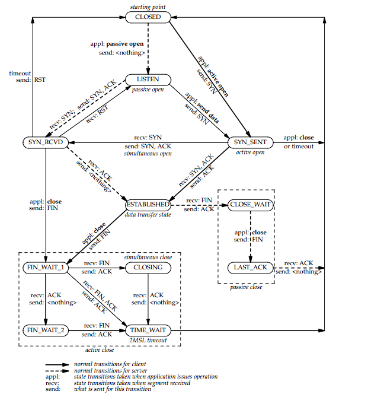
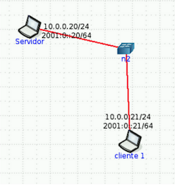

# Práctica 5 Capa de Transporte - Parte I

1. ## ¿Cuál es la función de la capa de transporte?

    La capa de transporte provee comunicación lógica entre procesos. Es responsable de la entrega de datos entre aplicaciones, asegurando que los datos se transmitan de manera confiable y en el orden correcto. Además, maneja la segmentación de datos, el control de flujo y la corrección de errores.

- ## 2. Describa la estructura del segmento TCP y UDP.

    - ### Segmento TCP:
        - Encabezado TCP:
            - Número de puerto de origen: Identifica el puerto del proceso que envía los datos.
            - Número de puerto de destino: Identifica el puerto del proceso que recibe los datos.
            - Número de secuencia: Utilizado para ordenar los segmentos y detectar pérdidas.
            - Número de acuse de recibo: Indica el número de secuencia del próximo segmento esperado.
            - Flags: Controlan el establecimiento, mantenimiento y finalización de la conexión.
            - Ventana: Controla el flujo de datos entre el emisor y el receptor.
            - Checksum: Verifica la integridad de los datos transmitidos.
            - Urgente: Indica si hay datos urgentes que deben ser procesados de inmediato.
        - Opciones: Permite la inclusión de opciones adicionales para mejorar el rendimiento o la seguridad.
        - Datos: La carga útil que se está transmitiendo.

    - ### Segmento UDP:
        - Encabezado UDP:
            - Número de puerto de origen: Identifica el puerto del proceso que envía los datos.
            - Número de puerto de destino: Identifica el puerto del proceso que recibe los datos.
            - Longitud: Indica la longitud total del segmento UDP, incluyendo el encabezado y los datos.
            - Checksum: Verifica la integridad de los datos transmitidos.
        - Datos: La carga útil que se está transmitiendo.

- ## 3. ¿Cuál es el objetivo del uso de puertos en el modelo TCP/IP?

    El objetivo del uso de puertos en el modelo TCP/IP es permitir la multiplexación de múltiples aplicaciones o servicios en una sola dirección IP. Los puertos actúan como puntos de acceso para las aplicaciones, permitiendo que los datos se dirijan al proceso correcto en el host receptor. Esto facilita la comunicación entre diferentes aplicaciones y servicios, ya que cada uno puede escuchar en un puerto específico para recibir datos.

- ## 4. Compare TCP y UDP en cuanto a:
    - ### a. Confiabilidad

        - TCP es un protocolo orientado a la conexión que garantiza la entrega de datos, el orden correcto y la corrección de errores. Utiliza mecanismos como acuses de recibo y retransmisiones para asegurar que los datos lleguen correctamente.

        - UDP es un protocolo sin conexión que no garantiza la entrega de datos ni el orden correcto. No utiliza acuses de recibo ni retransmisiones, lo que lo hace más rápido pero menos confiable que TCP.

    - ### b. Multiplexación.

        - TCP utiliza puertos para multiplexar múltiples conexiones entre aplicaciones. Cada conexión TCP se identifica por una combinación de dirección IP y número de puerto, lo que permite que múltiples aplicaciones se comuniquen simultáneamente sin interferencias.

        - UDP también utiliza puertos para multiplexar datos entre aplicaciones, pero debido a su naturaleza sin conexión, no establece una conexión formal entre el emisor y el receptor. Esto permite que los datos se envíen rápidamente, pero sin la garantía de entrega o el orden correcto.

    - ### c. Orientado a la conexión.

        - TCP es un protocolo orientado a la conexión, lo que significa que establece una conexión formal entre el emisor y el receptor antes de transmitir datos. Esto implica un proceso de establecimiento de conexión (handshake) y un proceso de finalización de conexión para garantizar una comunicación confiable.

        - UDP es un protocolo sin conexión, lo que significa que no establece una conexión formal entre el emisor y el receptor. Los datos se envían sin previo aviso, lo que permite una comunicación más rápida pero sin la garantía de entrega o el orden correcto.

    - ### d. Controles de congestión.

        - TCP implementa controles de congestión para evitar la sobrecarga de la red. Utiliza algoritmos como el control de congestión de TCP Reno o TCP Cubic para ajustar la tasa de transmisión de datos en función de las condiciones de la red, reduciendo la velocidad cuando se detecta congestión.

        - UDP no implementa controles de congestión, lo que significa que puede enviar datos a una velocidad constante sin tener en cuenta las condiciones de la red. Esto puede resultar en una mayor eficiencia en redes con baja congestión, pero también puede causar problemas en redes congestionadas, ya que no ajusta su tasa de transmisión.

    - ### e. Utilización de puertos.

        - TCP utiliza puertos para identificar las aplicaciones que se comunican. Cada conexión TCP se asocia con un número de puerto específico, lo que permite que múltiples aplicaciones se comuniquen simultáneamente sin interferencias.

        - UDP también utiliza puertos para identificar las aplicaciones que se comunican, pero debido a su naturaleza sin conexión, no establece una conexión formal entre el emisor y el receptor. Esto permite que los datos se envíen rápidamente, pero sin la garantía de entrega o el orden correcto.

5. ## La PDU de la capa de transporte es el segmento. Sin embargo, en algunos contextos suele utilizarse el término datagrama. Indique cuando.

    El término "datagrama" se utiliza comúnmente en el contexto de UDP, ya que UDP es un protocolo sin conexión que transmite datos en unidades llamadas datagramas. Un datagrama es una unidad de datos que se envía a través de la red sin establecer una conexión previa entre el emisor y el receptor. En contraste, el término "segmento" se utiliza más comúnmente en el contexto de TCP, ya que TCP es un protocolo orientado a la conexión que transmite datos en unidades llamadas segmentos. Un segmento es una unidad de datos que se envía a través de la red después de establecer una conexión entre el emisor y el receptor.

6. ## Describa el saludo de tres vías de TCP. ¿UDP tiene esta característica?

    El saludo de tres vías de TCP es un proceso de establecimiento de conexión que consta de tres pasos:

    1. El cliente envía un segmento SYN (synchronize) al servidor para iniciar la conexión.
    2. El servidor responde con un segmento SYN-ACK (synchronize-acknowledge) para aceptar la solicitud de conexión.
    3. El cliente envía un segmento ACK (acknowledge) para confirmar la recepción del segmento SYN-ACK y completar el establecimiento de la conexión.

    UDP no tiene esta característica, ya que es un protocolo sin conexión. No establece una conexión formal entre el emisor y el receptor antes de transmitir datos, lo que significa que no utiliza un proceso de saludo de tres vías como TCP. En cambio, los datos se envían directamente sin previo aviso, lo que permite una comunicación más rápida pero sin la garantía de entrega o el orden correcto.

7. ## Investigue qué es el ISN (Initial Sequence Number). Relaciónelo con el saludo de tres vías.

    El ISN (Initial Sequence Number) es un número aleatorio que se asigna al inicio de una conexión TCP. Es utilizado para identificar de manera única cada conexión y para garantizar la seguridad y la integridad de los datos transmitidos. Durante el saludo de tres vías, el cliente y el servidor intercambian sus ISN para establecer la conexión. El cliente envía su ISN en el segmento SYN, el servidor responde con su propio ISN en el segmento SYN-ACK, y el cliente confirma la recepción del ISN del servidor en el segmento ACK. Esto permite que ambos lados de la conexión mantengan un seguimiento de los segmentos transmitidos y recibidos, asegurando una comunicación confiable.

8. ## Investigue qué es el MSS. ¿Cuándo y cómo se negocia?

    El MSS (Maximum Segment Size) es el tamaño máximo de segmento que un dispositivo puede recibir en una conexión TCP. Es utilizado para evitar la fragmentación de los segmentos en la red, lo que puede mejorar el rendimiento y la eficiencia de la comunicación. Durante el saludo de tres vías, el cliente y el servidor pueden negociar el MSS utilizando opciones en los segmentos SYN y SYN-ACK. El cliente puede incluir su MSS en el segmento SYN, y el servidor puede responder con su propio MSS en el segmento SYN-ACK. Esto permite que ambos lados de la conexión acuerden un tamaño de segmento que sea compatible con sus capacidades y las condiciones de la red, optimizando así la transmisión de datos.

9. ## Utilice el comando ss (reemplazo de netstat) para obtener la siguiente información de su PC:
    - ### a. Para listar las comunicaciones TCP establecidas.
        `ss -t`
    - ### b. Para listar las comunicaciones UDP establecidas.
        `ss -u`
    - ### c. Obtener sólo los servicios TCP que están esperando comunicaciones
        `ss -tln`
    - ### d. Obtener sólo los servicios UDP que están esperando comunicaciones.
        `ss -uln`
    - ### e. Repetir los anteriores para visualizar el proceso del sistema asociado a la conexión.
        `ss -tulp`
    - ### f. Obtenga la misma información planteada en los items anteriores usando el comando netstat.
        - Para listar las comunicaciones TCP establecidas:
            `netstat -t`
        - Para listar las comunicaciones UDP establecidas:
            `netstat -u`
        - Obtener sólo los servicios TCP que están esperando comunicaciones:
            `netstat -tln`
        - Obtener sólo los servicios UDP que están esperando comunicaciones:
            `netstat -uln`
        - Repetir los anteriores para visualizar el proceso del sistema asociado a la conexión:
            `netstat -tulp`

10. ## ¿Qué sucede si llega un segmento TCP con el flag SYN activo a un host que no tiene ningún proceso esperando en el puerto destino de dicho segmento (es decir, el puerto destino no está en estado LISTEN)?

    Si llega un segmento TCP con el flag SYN activo a un host que no tiene ningún proceso esperando en el puerto destino, el host responderá con un segmento TCP con el flag RST (reset) activo. Esto indica que la conexión no puede ser establecida porque no hay ningún proceso escuchando en ese puerto. El host receptor envía este segmento RST para informar al emisor que la conexión no puede ser aceptada, y el emisor debe finalizar su intento de establecer la conexión.

    - ### a. Utilice hping3 para enviar paquetes TCP al puerto destino 22 de la máquina virtual con el flag SYN activado.

        ```bash
        sudo hping -S -p 22 localhost

        HPING localhost (lo 127.0.0.1): S set, 40 headers + 0 data bytes
        len=44 ip=127.0.0.1 ttl=64 DF id=0 sport=22 flags=SA seq=0 win=65495 rtt=7.8 ms
        len=44 ip=127.0.0.1 ttl=64 DF id=0 sport=22 flags=SA seq=1 win=65495 rtt=11.0 ms
        len=44 ip=127.0.0.1 ttl=64 DF id=0 sport=22 flags=SA seq=2 win=65495 rtt=3.3 ms
        len=44 ip=127.0.0.1 ttl=64 DF id=0 sport=22 flags=SA seq=3 win=65495 rtt=7.9 ms
        len=44 ip=127.0.0.1 ttl=64 DF id=0 sport=22 flags=SA seq=4 win=65495 rtt=3.5 ms
        len=44 ip=127.0.0.1 ttl=64 DF id=0 sport=22 flags=SA seq=5 win=65495 rtt=2.8 ms
        len=44 ip=127.0.0.1 ttl=64 DF id=0 sport=22 flags=SA seq=6 win=65495 rtt=2.0 ms
        len=44 ip=127.0.0.1 ttl=64 DF id=0 sport=22 flags=SA seq=7 win=65495 rtt=0.9 ms
        len=44 ip=127.0.0.1 ttl=64 DF id=0 sport=22 flags=SA seq=8 win=65495 rtt=0.4 ms
        len=44 ip=127.0.0.1 ttl=64 DF id=0 sport=22 flags=SA seq=9 win=65495 rtt=4.0 ms
        len=44 ip=127.0.0.1 ttl=64 DF id=0 sport=22 flags=SA seq=10 win=65495 rtt=7.4 ms
        len=44 ip=127.0.0.1 ttl=64 DF id=0 sport=22 flags=SA seq=11 win=65495 rtt=11.0 ms
        ```
    - ### b. Utilice hping3 para enviar paquetes TCP al puerto destino 40 de la máquina virtual con el flag SYN activado.

        ```bash
        sudo hping -S -p 40 localhost

        HPING localhost (lo 127.0.0.1): S set, 40 headers + 0 data bytes
        len=40 ip=127.0.0.1 ttl=64 DF id=0 sport=40 flags=RA seq=0 win=0 rtt=8.0 ms
        len=40 ip=127.0.0.1 ttl=64 DF id=0 sport=40 flags=RA seq=1 win=0 rtt=6.9 ms
        len=40 ip=127.0.0.1 ttl=64 DF id=0 sport=40 flags=RA seq=2 win=0 rtt=2.1 ms
        len=40 ip=127.0.0.1 ttl=64 DF id=0 sport=40 flags=RA seq=3 win=0 rtt=2.3 ms
        len=40 ip=127.0.0.1 ttl=64 DF id=0 sport=40 flags=RA seq=4 win=0 rtt=1.0 ms
        len=40 ip=127.0.0.1 ttl=64 DF id=0 sport=40 flags=RA seq=5 win=0 rtt=7.5 ms
        len=40 ip=127.0.0.1 ttl=64 DF id=0 sport=40 flags=RA seq=6 win=0 rtt=7.0 ms
        len=40 ip=127.0.0.1 ttl=64 DF id=0 sport=40 flags=RA seq=7 win=0 rtt=1.9 ms
        len=40 ip=127.0.0.1 ttl=64 DF id=0 sport=40 flags=RA seq=8 win=0 rtt=1.6 ms
        len=40 ip=127.0.0.1 ttl=64 DF id=0 sport=40 flags=RA seq=9 win=0 rtt=1.9 ms
        len=40 ip=127.0.0.1 ttl=64 DF id=0 sport=40 flags=RA seq=10 win=0 rtt=4.8 ms
        ```
    - ### c. ¿Qué diferencias nota en las respuestas obtenidas en los dos casos anteriores? ¿Puede explicar a qué se debe? (Ayuda: utilice el comando ss visto anteriormente).

        En el primer caso, al enviar paquetes TCP con el flag SYN activado al puerto destino 22, se observa que el host responde con segmentos TCP con el flag SYN-ACK activo. Esto indica que hay un proceso escuchando en el puerto 22 y que la conexión se está estableciendo correctamente.

        En el segundo caso, al enviar paquetes TCP con el flag SYN activado al puerto destino 40, se observa que el host responde con segmentos TCP con el flag RST (reset) activo. Esto indica que no hay ningún proceso escuchando en el puerto 40 y que la conexión no puede ser establecida.

        La diferencia en las respuestas se debe a la presencia o ausencia de un proceso escuchando en el puerto destino. En el primer caso, el puerto 22 está en estado LISTEN, lo que permite que la conexión se establezca correctamente. En el segundo caso, el puerto 40 no está en estado LISTEN, lo que provoca que el host responda con un segmento RST para indicar que la conexión no puede ser aceptada.

12. ## Investigue los distintos tipos de estado que puede tener una conexión TCP. Ver [TCIP_State_Transition_Diagram](https://users.cs.northwestern.edu/~agupta/cs340/project2/TCPIP_State_Transition_Diagram.pdf)

    

13. ## Dada la siguiente salida del comando ss, responda:

    ```bash
    Netid State Recv-Q Send-Q Local Address:Port Peer Address:Port Process
    tcp LISTEN 0 128 *:22 *:* users:(("sshd",pid=468,fd=29))
    tcp LISTEN 0 128 *:80 *:* users:(("apache2",pid=991,fd=95))
    udp LISTEN 0 128 163.10.5.222:53 *:* users:(("named",pid=452,fd=10))
    tcp ESTAB 0 0 163.10.5.222:59736 64.233.163.120:443 users:(("x-www-browser",pid=1079,fd=51))
    tcp CLOSE-WAI T 0 0 163.10.5.222:41654 200.115.89.30:443 users:(("x-www-browser",pid=1079,fd=50))
    tcp ESTAB 0 0 163.10.5.222:59737 64.233.163.120:443 users:(("x-www-browser",pid=1079,fd=55))
    tcp ESTAB 0 0 163.10.5.222:33583 200.115.89.15:443 users:(("x-www-browser",pid=1079,fd=53))
    tcp ESTAB 0 0 163.10.5.222:45293 64.233.190.99:443 users:(("x-www-browser",pid=1079,fd=59))
    tcp LISTEN 0 128 *:25 *:* users:(("postfix",pid=627,fd=3))
    tcp ESTAB 0 0 127.0.0.1:22 127.0.0.1:41220 users:(("sshd",pid=1418,fd=3), ("sshd",pid=1416,fd=3))
    tcp ESTAB 0 0 163.10.5.222:52952 64.233.190.94:443 users:(("x-www-browser",pid=1079,fd=29))
    tcp TIME-WAIT 0 0 163.10.5.222:36676 54.149.207.17:443 users:(("x-www-browser",pid=1079,fd=3))
    tcp ESTAB 0 0 163.10.5.222:52960 64.233.190.94:443 users:(("x-www-browser",pid=1079,fd=67))
    tcp ESTAB 0 0 163.10.5.222:50521 200.115.89.57:443 users:(("x-www-browser",pid=1079,fd=69))
    tcp SYN-SENT 0 0 163.10.5.222:52132 43.232.2.2:9500 users:(("x-www-browser",pid=1079,fd=70))
    tcp ESTAB 0 0 127.0.0.1:41220 127.0.0.1:22 users:(("ssh",pid=1415,fd=3))
    udp LISTEN 0 128 127.0.0.1:53 *:* users:(("named",pid=452,fd=9))
    ```

    - ### a. ¿Cuántas conexiones hay establecidas?

        Hay 9 conexiones establecidas, que se pueden identificar por el estado "ESTAB" en la salida del comando ss. Estas conexiones son:

        - `tcp ESTAB 0 0 163.10.5.222:59736 64.233.163.120:443 users:(("x-www-browser",pid=1079,fd=51))`
        - `tcp ESTAB 0 0 163.10.5.222:59737 64.233.163.120:443 users:(("x-www-browser",pid=1079,fd=55))`
        - `tcp ESTAB 0 0 163.10.5.222:33583 200.115.89.15:443 users:(("x-www-browser",pid=1079,fd=53))`
        - `tcp ESTAB 0 0 163.10.5.222:45293 64.233.190.99:443 users:(("x-www-browser",pid=1079,fd=59))`
        - `tcp ESTAB 0 0 127.0.0.1:22 127.0.0.1:41220 users:(("sshd",pid=1418,fd=3), ("sshd",pid=1416,fd=3))`
        - `tcp ESTAB 0 0 163.10.5.222:52952 64.233.190.94:443 users:(("x-www-browser",pid=1079,fd=29))`
        - `tcp ESTAB 0 0 163.10.5.222:52960 64.233.190.94:443 users:(("x-www-browser",pid=1079,fd=67))`
        - `tcp ESTAB 0 0 163.10.5.222:50521 200.115.89.57:443 users:(("x-www-browser",pid=1079,fd=69))`
        - `tcp ESTAB 0 0 127.0.0.1:41220 127.0.0.1:22 users:(("ssh",pid=1415,fd=3))`

    - ### b. ¿Cuántos puertos hay abiertos a la espera de posibles nuevas conexiones?

        Hay 5 puertos abiertos a la espera de posibles nuevas conexiones, que se pueden identificar por el estado "LISTEN" en la salida del comando ss. Estos puertos son:

        - `tcp LISTEN 0 128 *:22 *:* users:(("sshd",pid=468,fd=29))`
        - `tcp LISTEN 0 128 *:80 *:* users:(("apache2",pid=991,fd=95))`
        - `udp LISTEN 0 128 163.10.5.222:53 *:* users:(("named",pid=452,fd=9))`
        - `tcp LISTEN 0 128 *:25 *:* users:(("postfix",pid=627,fd=3))`
        - `udp LISTEN 0 128 163.10.5.222:53 *:* users:(("named",pid=452,fd=9))`

    - ### c. El cliente y el servidor de las comunicaciones HTTPS (puerto 443), ¿residen en la misma máquina?

        No, el cliente y el servidor de las comunicaciones HTTPS (puerto 443) no residen en la misma máquina. En la salida del comando ss, se puede observar que las conexiones HTTPS están establecidas entre la dirección IP local y varias direcciones IP remotas, lo que indica que el cliente y el servidor están en máquinas diferentes.

    - ### d. El cliente y el servidor de la comunicación SSH (puerto 22), ¿residen en la misma máquina?

        Sí, el cliente y el servidor de la comunicación SSH (puerto 22) residen en la misma máquina. En la salida del comando ss, se puede observar que hay una conexión establecida entre la dirección IP local (127.0.0.1) y la dirección IP remota (127.0.0.1). Esto indica que tanto el cliente como el servidor de la comunicación SSH están en la misma máquina, utilizando la dirección de loopback para comunicarse entre sí.

    - ### e. Liste los nombres de todos los procesos asociados con cada comunicación. Indique para cada uno si se trata de un proceso cliente o uno servidor.

        Los procesos asociados con cada comunicación son:
        - sshd
        - apache2
        - named
        - x-www-browser
        - ssh

    - ### f. ¿Cuáles conexiones tuvieron el cierre iniciado por el host local y cuáles por el remoto?

        Las conexiones que tuvieron el cierre iniciado por el host local son aquellas que están en estado "TIME-WAIT". En la salida del comando ss, se puede observar que la conexión `tcp TIME-WAIT 0 0 163.10.5.222:59737 64.233.163.120:443 users:(("x-www-browser",pid=1079,fd=55))` está en estado "TIME-WAIT".

        Las conexiones que tuvieron el cierre iniciado por el host remoto son aquellas que están en estado "CLOSE-WAIT". En la salida del comando ss, se puede observar que la conexión `tcp CLOSE-WAI T 0 0 163.10.5.222:59737 64.233.163.120:443 users:(("x-www-browser",pid=1079,fd=55))` está en estado "CLOSE-WAIT".

    - ### g. ¿Cuántas conexiones están aún pendientes por establecerse?

        Hay 1 conexión pendiente por establecerse, que se puede identificar por el estado "SYN-SENT" en la salida del comando ss. Esta conexión es:

        - `tcp SYN-SENT 0 0 163.10.5.222:59737 64.233.163.120:443 users:(("x-www-browser",pid=1079,fd=55))`

14. ## Dadas las salidas de los siguientes comandos ejecutados en el cliente y el servidor, responder:

    ```bash
    servidor# ss -natu | grep 110
    tcp LISTEN 0 0 *:110 *:*
    tcp SYN-RECV 0 0 157.0.0.1:110 157.0.11.1:52843

    cliente# ss -natu | grep 110
    tcp SYN-SENT 0 1 157.0.11.1:52843 157.0.0.1:110
    ```

    - ### a. ¿Qué segmentos llegaron y cuáles se están perdiendo en la red?

        En la salida del comando ss, se puede observar que el servidor tiene un segmento en estado "SYN-RECV", lo que indica que ha recibido un segmento SYN del cliente. Sin embargo, el cliente tiene un segmento en estado "SYN-SENT", lo que indica que ha enviado un segmento SYN pero aún no ha recibido una respuesta del servidor. Esto sugiere que el segmento SYN enviado por el cliente se ha perdido en la red, ya que el servidor no ha podido responder con un segmento SYN-ACK.

    - ### b. ¿A qué protocolo de capa de aplicación y de transporte se está intentando conectar elcliente?

        El cliente se está intentando conectar a un servidor de correo electrónico utilizando el protocolo POP3 (Post Office Protocol version 3) en la capa de aplicación, y el protocolo TCP (Transmission Control Protocol) en la capa de transporte. Esto se deduce del puerto 110, que es el puerto estándar para el servicio POP3.

    - ### c. ¿Qué flags tendría seteado el segmento perdido?

        El segmento perdido tendría seteado el flag SYN (synchronize), ya que el cliente está intentando establecer una conexión con el servidor. El flag SYN se utiliza para iniciar el proceso de establecimiento de conexión en TCP, y su presencia indica que el segmento es un intento de iniciar una nueva conexión.

15. ## Use CORE para armar una topología como la siguiente, sobre la cual deberá realizar:

    

    - ### a. En ambos equipos inspeccionar el estado de las conexiones y mantener abiertas ambas ventanas con el comando corriendo para poder visualizar los cambios a medida que se realiza el ejercicio. Ayuda: watch -n1 ’ss -nat’.

    - ### b. En Servidor, utilice la herramienta ncat para levantar un servicio que escuche en el puerto 8001/TCP. Utilice la opción -k para que el servicio sea persistente. Verifique el estado de las conexiones.

    - ### c. Desde CLIENTE1 conectarse a dicho servicio utilizando también la herramienta ncat. Inspeccione el estado de las conexiones.

    - ### d. Iniciar otra conexión desde CLIENTE1 de la misma manera que la anterior y verificar el estado de las conexiones. ¿De qué manera puede identificar cada conexión?

    - ### e. En base a lo observado en el item anterior, ¿es posible iniciar más de una conexión desde el cliente al servidor en el mismo puerto destino? ¿Por qué? ¿Cómo se garantiza que los datos de una conexión no se mezclarán con los de la otra?

    - ### f. Analice en el tráfico de red, los flags de los segmentos TCP que ocurren cuando:

        - #### i. Cierra la última conexión establecida desde CLIENTE1. Evalúe los estados de las conexiones en ambos equipos.

        - #### ii. Corta el servicio de ncat en el servidor (Ctrl+C). Evalúe los estados de las conexiones en ambos equipos.

        - #### iii. Cierra la conexión en el cliente. Evalúe nuevamente los estados de las conexiones.
