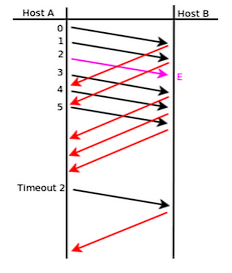
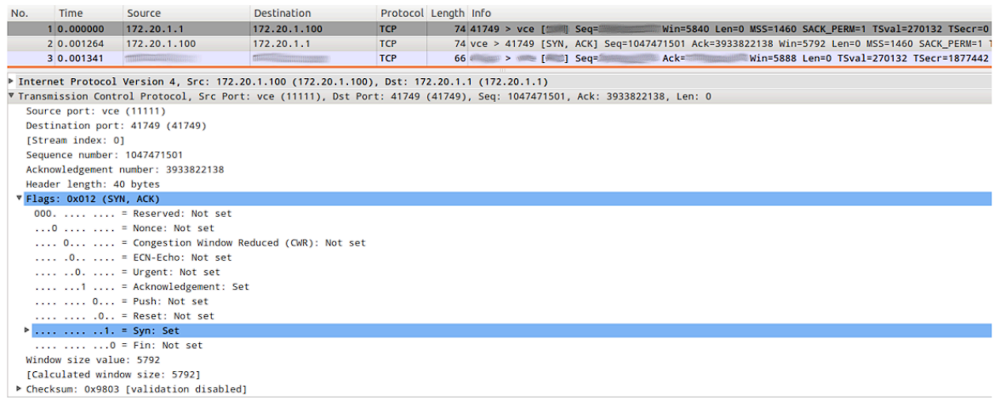
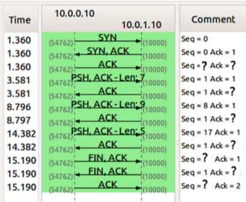
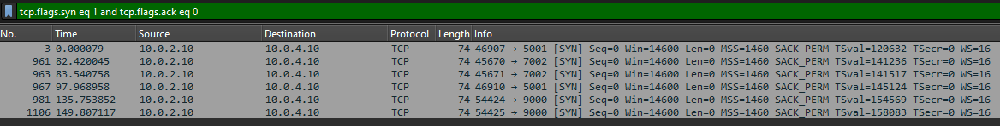

# Practica 6 Capa de Transporte - Parte II

1. ## ¿Cuál es el puerto por defecto que se utiliza en los siguientes servicios? Web / SSH / DNS / Web Seguro / POP3 / IMAP / SMTP. Investigue en qué lugar en Linux y en Windows está descrita la asociación utilizada por defecto para cada servicio.

    - Web: 80
    - SSH: 22
    - DNS: 53
    - Web Seguro: 443
    - POP3: 110
    - IMAP: 143
    - SMTP: 25

    En Linux, la asociación de puertos se encuentra en el archivo `/etc/services`. En Windows, esta información se puede encontrar en el archivo `C:\Windows\System32\drivers\etc\services`.

2. ## Investigue qué es multicast. ¿Sobre cuál de los protocolos de capa de transporte funciona? ¿Se podría adaptar para que funcione sobre el otro protocolo de capa de transporte? ¿Por qué?

    Multicast es una técnica de comunicación en la que un solo paquete de datos se envía a múltiples destinatarios al mismo tiempo. Funciona principalmente sobre el protocolo UDP (User Datagram Protocol) debido a su naturaleza sin conexión y su capacidad para enviar datos a múltiples destinatarios sin necesidad de establecer una conexión previa.

    Adaptar multicast para que funcione sobre TCP (Transmission Control Protocol) sería complicado debido a la naturaleza orientada a la conexión de TCP. TCP requiere que se establezca una conexión entre el emisor y cada receptor, lo que no es eficiente para la transmisión de datos a múltiples destinatarios. Además, TCP garantiza la entrega de datos, lo que puede introducir retrasos y complicaciones adicionales en un entorno multicast. Por estas razones, multicast se utiliza principalmente con UDP.

3. ## Investigue cómo funciona el protocolo de aplicación FTP teniendo en cuenta las diferencias en su funcionamiento cuando se utiliza el modo activo de cuando se utiliza el modo pasivo ¿En qué se diferencian estos tipos de comunicaciones del resto de los protocolos de aplicación vistos?

    El protocolo FTP (File Transfer Protocol) tiene dos modos de operación: activo y pasivo.

    - En el modo activo, el cliente establece una conexión de control con el servidor en el puerto 21. Luego, el servidor inicia una conexión de datos desde su puerto 20 hacia un puerto aleatorio en el cliente para transferir los archivos. Esto puede causar problemas con firewalls y NAT, ya que el servidor intenta establecer una conexión hacia el cliente.

    - En el modo pasivo, el cliente establece la conexión de control con el servidor en el puerto 21, pero en lugar de que el servidor inicie la conexión de datos, el cliente solicita al servidor que abra un puerto aleatorio para la transferencia de datos. El cliente luego se conecta a ese puerto para transferir los archivos. Este modo es más compatible con firewalls y NAT, ya que todas las conexiones son iniciadas por el cliente.

    La principal diferencia entre estos modos de comunicación y otros protocolos de aplicación es la forma en que se establecen las conexiones para la transferencia de datos. En otros protocolos como HTTP o SMTP, las conexiones suelen ser iniciadas por el cliente y no requieren que el servidor establezca conexiones hacia el cliente, lo que simplifica la comunicación y mejora la compatibilidad con firewalls y NAT.

4. ## Suponiendo Selective Repeat; tamaño de ventana 4 y sabiendo que E indica que el mensaje llegó con errores. Indique en el siguiente gráfico, la numeración de los ACK que el host B envía al Host A.
    

    El host B enviará los siguientes ACK al Host A:
    - ACK 0 (para el mensaje 0)
    - ACK 1 (para el mensaje 1)
    - ACK 3 (para el mensaje 3, ya que el mensaje 2 llegó con errores)
    - ACK 4 (para el mensaje 4)
    - ACK 5 (para el mensaje 5)
    - ACK 2 (para el mensaje 2, una vez que se reenvíe y llegue correctamente)

5. ## ¿Qué restricción existe sobre el tamaño de ventanas en el protocolo Selective Repeat?

    En el protocolo Selective Repeat, el tamaño de la ventana debe ser menor o igual a la mitad del número total de secuencias disponibles. Esto se debe a que el protocolo utiliza números de secuencia para identificar los paquetes, y si el tamaño de la ventana es mayor que la mitad del número total de secuencias, podría haber ambigüedad en la identificación de los paquetes, lo que podría llevar a errores en la transmisión y recepción de datos.

6. ## De acuerdo a la captura TCP de la siguiente figura, indique los valores de los campos borroneados.

    

    - SYN en la linea 1 y Seq = 3933822137
    - 172.20.1.1 en Source, 172.20.1.100 en Destination 41749 > vce en Puertos, ACK, Seq= 3933822138, Ack= 1047471502

7. ## Dada la sesión TCP de la figura, completar los valores marcados con un signo de interrogación.

    

    - Seq = 1, Ack = 1
    - Ack = 8
    - Ack = 17
    - Ack = 22
    - Seq = 22
    - Ack = 23
    - Seq = 23

8. ## ¿Qué es el RTT y cómo se calcula? Investigue la opción TCP timestamp y los campos TSval y TSecr.

    El RTT (Round Trip Time) es el tiempo que tarda un paquete de datos en viajar desde el emisor hasta el receptor y regresar al emisor. Se calcula midiendo el tiempo transcurrido desde que se envía un paquete hasta que se recibe un ACK correspondiente.

    La opción TCP timestamp es una extensión del protocolo TCP que permite medir con mayor precisión el RTT y mejorar la gestión de la congestión. Los campos TSval (Timestamp Value) y TSecr (Timestamp Echo Reply) se utilizan para registrar el tiempo en que se envió un segmento y para devolver ese valor al emisor, respectivamente. Esto permite al emisor calcular el RTT de manera más precisa, incluso en presencia de retransmisiones o paquetes duplicados.

9. Para la captura tcp-captura.pcap, responder las siguientes preguntas.

- ### a. ¿Cuántos intentos de conexiones TCP hay?

    
- ### b. ¿Cuáles son la fuente y el destino (IP:port) para c/u?
- ### c. ¿Cuántas conexiones TCP exitosas hay en la captura? ¿Cómo diferencia las exitosas de las que no lo son? ¿Cuáles flags encuentra en cada una?
- ### d. Dada la primera conexión exitosa responder:
    - #### i. ¿Quién inicia la conexión?
    - #### ii. ¿Quién es el servidor y quién el cliente?
    - #### iii. ¿En qué segmentos se ve el 3-way handshake?
    - #### iv. ¿Cuáles ISNs se intercambian?
    - #### v. ¿Cuál MSS se negoció?
    - #### vi. ¿Cuál de los dos hosts envía la mayor cantidad de datos (IP:port)?
- ### e. Identificar primer segmento de datos (origen, destino, tiempo, número de fila y número de secuencia TCP).
    - #### i. ¿Cuántos datos lleva?
    - #### ii. ¿Cuándo es confirmado (tiempo, número de fila y número de secuencia TCP)?
    - #### iii. La confirmación, ¿qué cantidad de bytes confirma?
- ### f. ¿Quién inicia el cierre de la conexión? ¿Qué flags se utilizan? ¿En cuáles segmentos se ve (tiempo, número de fila y número de secuencia TCP)?
